# Vextra: AI-Powered Content Management System

## Professional Project Thesis Documentation

---

# Table of Contents

1. [Executive Summary](#1-executive-summary)
2. [Introduction](#2-introduction)
   - 2.1 [Problem Statement](#21-problem-statement)
   - 2.2 [Objectives](#22-objectives)
   - 2.3 [Scope](#23-scope)
3. [System Architecture](#3-system-architecture)
   - 3.1 [High-Level Architecture](#31-high-level-architecture)
   - 3.2 [Technology Stack](#32-technology-stack)
   - 3.3 [System Components](#33-system-components)
4. [Low-Level Design (LLD)](#4-low-level-design-lld)
   - 4.1 [Backend Architecture](#41-backend-architecture)
   - 4.2 [Frontend Architecture](#42-frontend-architecture)
   - 4.3 [Database Design](#43-database-design)
   - 4.4 [API Design](#44-api-design)
5. [Data Flow Diagrams](#5-data-flow-diagrams)
   - 5.1 [Authentication Flow](#51-authentication-flow)
   - 5.2 [Content Creation Flow](#52-content-creation-flow)
   - 5.3 [Social Publishing Flow](#53-social-publishing-flow)
   - 5.4 [Real-time Chat Flow](#54-real-time-chat-flow)
6. [Entity Relationships](#6-entity-relationships)
   - 6.1 [ER Diagram](#61-er-diagram)
   - 6.2 [Model Descriptions](#62-model-descriptions)
7. [Module Specifications](#7-module-specifications)
   - 7.1 [Authentication Module](#71-authentication-module)
   - 7.2 [Content Creation Module](#72-content-creation-module)
   - 7.3 [Social Media Integration Module](#73-social-media-integration-module)
   - 7.4 [Real-time Chat Module](#74-real-time-chat-module)
   - 7.5 [Notification Module](#75-notification-module)
   - 7.6 [Social Network Module](#76-social-network-module)
8. [Security Implementation](#8-security-implementation)
9. [Deployment Architecture](#9-deployment-architecture)
10. [API Reference](#10-api-reference)
11. [Testing Strategy](#11-testing-strategy)
12. [Future Enhancements](#12-future-enhancements)
    - 12.1 [Planned Features](#planned-features)
    - 12.2 [Complete AI Workflow](#complete-ai-workflow-future-implementation)
    - 12.3 [Technical Improvements](#technical-improvements)
    - 12.4 [Infrastructure & Security Enhancements](#infrastructure--security-enhancements)
      - [Asynchronous Task Queue Architecture](#asynchronous-task-queue-architecture)
      - [Refresh Token Rotation](#refresh-token-rotation)
      - [Platform Size Limits & Constraints](#platform-size-limits--constraints)
      - [Schema Changes for Platform Connections](#schema-changes-for-platform-connections)
    - 12.5 [Resilience & Error Handling](#resilience--error-handling)
      - [Internet Connectivity Loss During Upload](#internet-connectivity-loss-during-upload)
      - [CMS AI Disconnection & Error Handling](#cms-ai-disconnection--error-handling)
13. [Conclusion](#13-conclusion)


---

# 1. Executive Summary

**Vextra** is an enterprise-grade AI-Powered Content Management System (ACMS) designed to revolutionize social media content creation and management. The platform enables users to create, edit, and publish content across multiple social media platforms (Instagram, Twitter/X, LinkedIn, Facebook) from a unified mobile interface.

## Key Features

- **Multi-Platform Publishing**: Post to Instagram, Twitter, LinkedIn, and Facebook simultaneously
- **AI-Assisted Content Creation**: Leverage AI to generate and enhance content
- **Real-time Messaging**: Instagram-style chat with WebSocket communication
- **Social Networking**: Follow/unfollow system with user discovery
- **Push Notifications**: Firebase Cloud Messaging integration
- **OAuth Integration**: Secure authentication with social platforms
- **Media Management**: Advanced image editing with filters, adjustments, and cropping

## Technical Highlights

| Aspect | Technology |
|--------|------------|
| Backend | FastAPI (Python 3.10+) |
| Frontend | Flutter/Dart |
| Database | PostgreSQL (Cloud SQL) |
| Storage | Google Cloud Storage |
| Hosting | Google Cloud Run |
| Real-time | WebSocket |
| Authentication | JWT + OAuth 2.0 |

---

# 2. Introduction

## 2.1 Problem Statement

In today's digital landscape, content creators and businesses face significant challenges:

1. **Platform Fragmentation**: Managing content across multiple social media platforms requires logging into each platform separately, leading to inefficiency and inconsistency.

2. **Time-Consuming Workflows**: Creating, editing, and publishing content is a repetitive process that consumes valuable time.

3. **Lack of Integration**: Existing tools often focus on single platforms, lacking unified cross-platform capabilities.

4. **Inconsistent Branding**: Publishing content separately across platforms leads to messaging inconsistencies.

5. **Limited Collaboration**: Creators struggle to engage with their audience and fellow creators in a unified environment.

## 2.2 Objectives

The Vextra ACMS aims to:

1. **Unify Content Management**: Provide a single platform to manage content across Instagram, Twitter, LinkedIn, and Facebook.

2. **Streamline Workflows**: Reduce content creation time through AI assistance and intuitive interfaces.

3. **Enable Cross-Platform Publishing**: Allow simultaneous publishing to multiple platforms with platform-specific optimizations.

4. **Foster Community**: Build an internal social network for creators to share, inspire, and collaborate.

5. **Ensure Security**: Implement industry-standard security practices for OAuth tokens and user data.

6. **Provide Real-time Communication**: Enable instant messaging between users within the platform.

## 2.3 Scope

### In Scope

- User authentication (email/password with OTP verification)
- Profile management with social links
- Content creation with media editing capabilities
- OAuth connection to social platforms
- Cross-platform content publishing
- Internal "Inspire" social feed
- Real-time chat messaging
- Push notifications
- User follow/unfollow system
- Online presence tracking

### Out of Scope

- Scheduling posts for future publication (planned for v2)
- Analytics and insights dashboard
- Team collaboration features
- Content calendar management
- AI image generation from prompts

---

# 3. System Architecture

## 3.1 High-Level Architecture

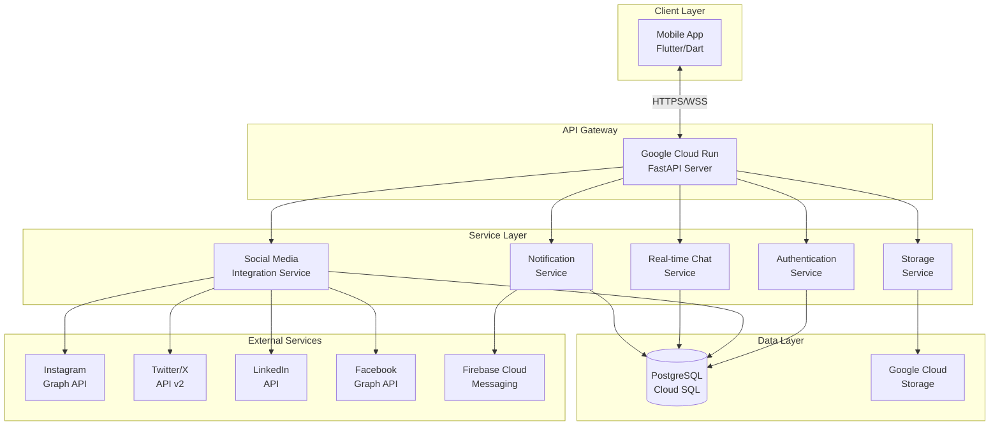
```mermaid
graph TB
    subgraph "Client Layer"
        MA[Mobile App<br/>Flutter/Dart]
    end
    
    subgraph "API Gateway"
        CR[Google Cloud Run<br/>FastAPI Server]
    end
    
    subgraph "Service Layer"
        AUTH[Authentication<br/>Service]
        SOCIAL[Social Media<br/>Integration Service]
        CHAT[Real-time Chat<br/>Service]
        NOTIFY[Notification<br/>Service]
        STORAGE[Storage<br/>Service]
    end
    
    subgraph "Data Layer"
        DB[(PostgreSQL<br/>Cloud SQL)]
        GCS[Google Cloud<br/>Storage]
    end
    
    subgraph "External Services"
        IG[Instagram<br/>Graph API]
        TW[Twitter/X<br/>API v2]
        LI[LinkedIn<br/>API]
        FB[Facebook<br/>Graph API]
        FCM[Firebase Cloud<br/>Messaging]
    end
    
    MA <-->|HTTPS/WSS| CR
    CR --> AUTH
    CR --> SOCIAL
    CR --> CHAT
    CR --> NOTIFY
    CR --> STORAGE
    
    AUTH --> DB
    SOCIAL --> DB
    CHAT --> DB
    NOTIFY --> DB
    STORAGE --> GCS
    
    SOCIAL --> IG
    SOCIAL --> TW
    SOCIAL --> LI
    SOCIAL --> FB
    NOTIFY --> FCM
```

## 3.2 Technology Stack

### Backend Technologies

| Component | Technology | Version | Purpose |
|-----------|------------|---------|---------|
| Web Framework | FastAPI | Latest | High-performance async API framework |
| Language | Python | 3.10+ | Backend programming language |
| ASGI Server | Uvicorn | Latest | ASGI server for production |
| ORM | SQLAlchemy | Latest | Database abstraction layer |
| Migrations | Alembic | Latest | Database schema migrations |
| Authentication | python-jose | Latest | JWT token handling |
| Password Hashing | passlib + bcrypt | 4.0.1 | Secure password hashing |
| HTTP Client | httpx | Latest | Async HTTP for external APIs |
| WebSocket | websockets | Latest | Real-time communication |
| Email | fastapi-mail | Latest | OTP verification emails |
| Cloud Storage | google-cloud-storage | Latest | File uploads |
| Push Notifications | firebase-admin | Latest | FCM integration |

### Frontend Technologies

| Component | Technology | Version | Purpose |
|-----------|------------|---------|---------|
| Framework | Flutter | 3.x | Cross-platform mobile UI |
| Language | Dart | 3.10.3+ | Frontend programming language |
| State Management | Provider | 6.1.5 | Reactive state management |
| Routing | go_router | 17.0.1 | Declarative routing |
| HTTP Client | Dio | 5.7.0 | HTTP requests with interceptors |
| Secure Storage | flutter_secure_storage | 10.0.0 | Secure token storage |
| WebSocket | web_socket_channel | 3.0.1 | Real-time communication |
| Push Notifications | firebase_messaging | 15.1.6 | FCM integration |
| Image Picker | image_picker | 1.0.7 | Media selection |
| Speech to Text | speech_to_text | 7.0.0 | Voice input |

### Infrastructure

| Component | Technology | Purpose |
|-----------|------------|---------|
| Container Platform | Google Cloud Run | Serverless container hosting |
| Database | Cloud SQL (PostgreSQL) | Managed relational database |
| Object Storage | Google Cloud Storage | Media file storage |
| Push Notifications | Firebase Cloud Messaging | Cross-platform push |
| CI/CD | Cloud Build | Automated deployment |

## 3.3 System Components

### Backend Components

```
backend/
├── app/
│   ├── api/
│   │   ├── deps.py              # Dependency injection
│   │   └── v1/
│   │       ├── api.py           # Router aggregation
│   │       └── endpoints/       # API endpoint modules
│   │           ├── auth.py      # Authentication endpoints
│   │           ├── users.py     # User management
│   │           ├── chat.py      # Messaging endpoints
│   │           ├── social.py    # Follow/search system
│   │           ├── oauth.py     # OAuth flow handlers
│   │           ├── publish.py   # Content publishing
│   │           ├── posts.py     # Post management
│   │           ├── notifications.py
│   │           ├── presence.py  # Online status
│   │           ├── settings.py  # User settings
│   │           ├── upload.py    # File uploads
│   │           └── websocket.py # WebSocket handlers
│   ├── core/
│   │   ├── config.py            # Application settings
│   │   ├── security.py          # JWT, password hashing
│   │   ├── encryption.py        # Token encryption
│   │   ├── email.py             # Email service
│   │   └── storage.py           # GCS integration
│   ├── crud/
│   │   ├── base.py              # Generic CRUD operations
│   │   ├── crud_user.py         # User CRUD
│   │   └── crud_post.py         # Post CRUD
│   ├── db/
│   │   ├── base.py              # SQLAlchemy base
│   │   └── session.py           # Database session
│   ├── models/
│   │   ├── user.py              # User model
│   │   ├── post.py              # Post model
│   │   ├── conversation.py      # Chat conversation
│   │   ├── message.py           # Chat message
│   │   ├── follow.py            # Follow relationships
│   │   ├── notification.py      # Notifications
│   │   ├── social_connection.py # OAuth connections
│   │   ├── settings.py          # User settings
│   │   └── otp.py               # OTP verification
│   ├── schemas/                 # Pydantic schemas
│   ├── services/
│   │   ├── fcm.py               # Firebase Cloud Messaging
│   │   └── social/
│   │       ├── base.py          # Abstract social service
│   │       ├── instagram.py     # Instagram integration
│   │       ├── twitter.py       # Twitter/X integration
│   │       ├── linkedin.py      # LinkedIn integration
│   │       └── facebook.py      # Facebook integration
│   └── main.py                  # Application entry point
├── alembic/                     # Database migrations
├── Dockerfile                   # Container configuration
└── requirements.txt             # Python dependencies
```

### Frontend Components

```
acms_app/lib/
├── main.dart                    # App entry + routing
├── core/                        # Core utilities
├── providers/
│   ├── auth_provider.dart       # Authentication state
│   ├── chat_provider.dart       # Chat state
│   ├── creation_provider.dart   # Content creation
│   ├── social_provider.dart     # Follow/search
│   ├── social_connections_provider.dart
│   ├── notification_provider.dart
│   ├── presence_provider.dart   # Online status
│   ├── settings_provider.dart
│   └── inspire_provider.dart    # Inspire feed
├── services/
│   ├── api_client.dart          # Dio HTTP client
│   ├── auth_service.dart        # Auth API calls
│   ├── chat_service.dart        # Chat API calls
│   ├── social_service.dart      # Social API calls
│   ├── oauth_service.dart       # OAuth flow
│   ├── post_service.dart        # Post management
│   ├── websocket_service.dart   # WebSocket client
│   ├── presence_service.dart    # Presence tracking
│   ├── notification_service.dart
│   ├── push_notification_service.dart
│   └── settings_service.dart
├── screens/
│   ├── auth/                    # Authentication screens
│   ├── onboarding/              # Onboarding flow
│   ├── home/                    # Home dashboard
│   ├── create/                  # Content creation
│   ├── inspire/                 # Social feed
│   ├── chats/                   # Messaging
│   ├── profile/                 # User profiles
│   ├── settings/                # App settings
│   └── notifications/           # Notification center
├── theme/                       # App theming
└── widgets/                     # Reusable widgets
```

---

# 4. Low-Level Design (LLD)

## 4.1 Backend Architecture

### Layered Architecture Pattern

The backend follows a strict **Layered Architecture** pattern ensuring separation of concerns:

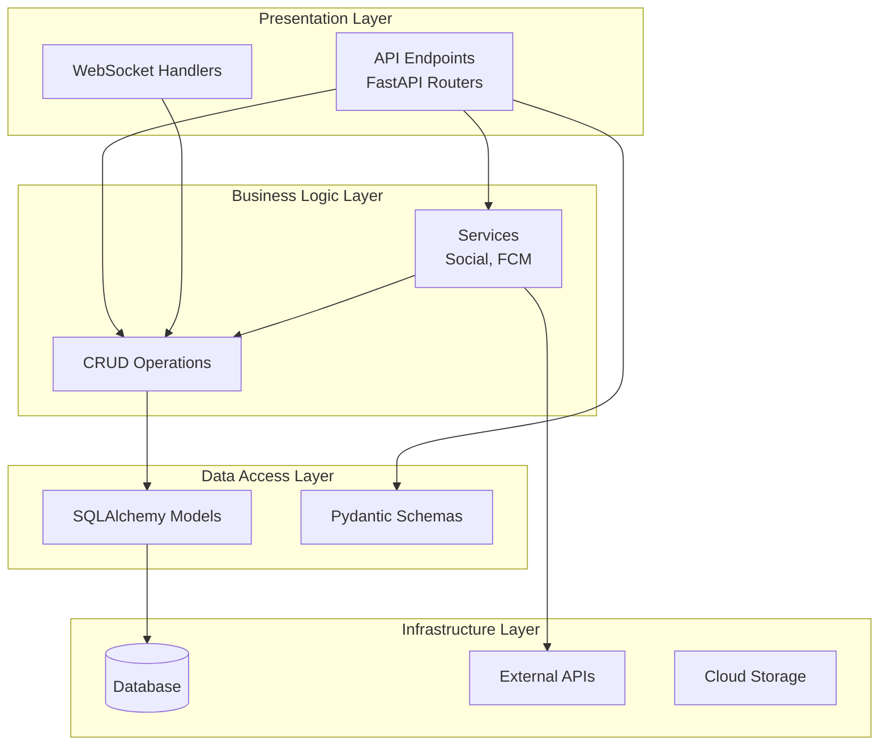
```mermaid
graph TB
    subgraph "Presentation Layer"
        EP[API Endpoints<br/>FastAPI Routers]
        WS[WebSocket Handlers]
    end
    
    subgraph "Business Logic Layer"
        SVC[Services<br/>Social, FCM]
        CRUD[CRUD Operations]
    end
    
    subgraph "Data Access Layer"
        MDL[SQLAlchemy Models]
        SCH[Pydantic Schemas]
    end
    
    subgraph "Infrastructure Layer"
        DB[(Database)]
        EXT[External APIs]
        STORE[Cloud Storage]
    end
    
    EP --> SVC
    EP --> CRUD
    WS --> CRUD
    SVC --> CRUD
    SVC --> EXT
    CRUD --> MDL
    MDL --> DB
    EP --> SCH
```

### Dependency Injection

FastAPI's dependency injection system is used for:

1. **Database Sessions**: Automatic session management per request
2. **Authentication**: Token validation and user extraction
3. **Authorization**: Role-based access control

```python
# deps.py - Core Dependencies
def get_db() -> Generator:
    """Yield database session with automatic cleanup"""
    try:
        db = SessionLocal()
        yield db
    finally:
        db.close()

def get_current_user(
    db: Session = Depends(get_db),
    token: str = Depends(reusable_oauth2)
) -> User:
    """Extract and validate current user from JWT"""
    payload = jwt.decode(token, settings.SECRET_KEY, algorithms=[ALGORITHM])
    user = crud.user.get(db, id=payload.get("sub"))
    if not user:
        raise HTTPException(status_code=404, detail="User not found")
    return user
```

### Service Pattern for Social Integrations

All social platform integrations inherit from `BaseSocialService`:

```python
class BaseSocialService(ABC):
    """Abstract base class for social platform integrations"""
    
    @property
    @abstractmethod
    def platform_name(self) -> str:
        """Return platform identifier"""
        pass

    @abstractmethod
    def get_authorization_url(self, state: str) -> str:
        """Generate OAuth authorization URL"""
        pass

    @abstractmethod
    async def exchange_code_for_token(self, code: str, state: str) -> Dict[str, Any]:
        """Exchange authorization code for access tokens"""
        pass

    @abstractmethod
    async def refresh_access_token(self, refresh_token: str) -> Dict[str, Any]:
        """Refresh expired access token"""
        pass

    @abstractmethod
    async def publish_post(
        self,
        access_token: str,
        content: str,
        media_urls: Optional[List[str]] = None,
        **kwargs
    ) -> Dict[str, Any]:
        """Publish content to platform"""
        pass

    @abstractmethod
    async def revoke_access(self, access_token: str) -> bool:
        """Revoke access token"""
        pass
```

## 4.2 Frontend Architecture

### Provider Pattern (State Management)

The Flutter application uses the **Provider** pattern for state management:

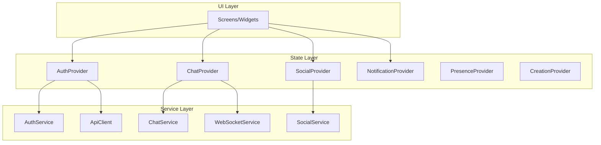
```mermaid
graph TB
    subgraph "UI Layer"
        SCR[Screens/Widgets]
    end
    
    subgraph "State Layer"
        AP[AuthProvider]
        CP[ChatProvider]
        SP[SocialProvider]
        NP[NotificationProvider]
        PP[PresenceProvider]
        CRP[CreationProvider]
    end
    
    subgraph "Service Layer"
        AS[AuthService]
        CS[ChatService]
        SS[SocialService]
        WS[WebSocketService]
        API[ApiClient]
    end
    
    SCR --> AP
    SCR --> CP
    SCR --> SP
    SCR --> NP
    
    AP --> AS
    CP --> CS
    CP --> WS
    SP --> SS
    AP --> API
```

### Key Providers

| Provider | Responsibility |
|----------|---------------|
| `AuthProvider` | User authentication state, login/logout, session management |
| `ChatProvider` | Conversations, messages, real-time chat state |
| `SocialProvider` | Follow system, user search, public profiles |
| `NotificationProvider` | Notification list, unread counts, marking read |
| `PresenceProvider` | Online user tracking |
| `CreationProvider` | Content creation flow state |
| `SocialConnectionsProvider` | Connected social platform accounts |
| `SettingsProvider` | User preferences and settings |
| `InspireProvider` | Internal social feed |

### Offline-First Architecture

The `AuthProvider` implements offline-first caching:

```dart
class AuthProvider extends ChangeNotifier {
  final _storage = const FlutterSecureStorage();
  
  /// Initialize with offline-first approach
  Future<void> _init() async {
    // 1. Try to load cached user first
    final cachedUser = await _loadCachedUser();
    if (cachedUser != null) {
      _user = cachedUser;
    }
    
    // 2. Check for stored token
    final token = await _storage.read(key: 'access_token');
    if (token != null) {
      // 3. Set token in API client
      ApiClient().setToken(token);
      
      // 4. Try to refresh from server
      try {
        await _fetchAndCacheUser();
      } catch (e) {
        if (_isNetworkError(e) && cachedUser != null) {
          // Network error but we have cached data - that's fine
          _isAuthenticated = true;
        }
      }
    }
  }
}
```

## 4.3 Database Design

### Schema Overview

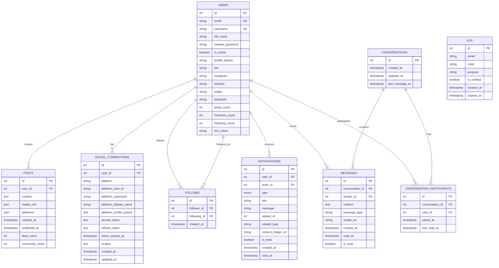
```mermaid
erDiagram
    USERS ||--o{ POSTS : creates
    USERS ||--o{ SOCIAL_CONNECTIONS : has
    USERS ||--o{ FOLLOWS : follows
    USERS ||--o{ FOLLOWS : followed_by
    USERS ||--o{ NOTIFICATIONS : receives
    USERS ||--o{ MESSAGES : sends
    USERS ||--o{ CONVERSATION_PARTICIPANTS : participates
    CONVERSATIONS ||--o{ MESSAGES : contains
    CONVERSATIONS ||--o{ CONVERSATION_PARTICIPANTS : has

    USERS {
        int id PK
        string email UK
        string username UK
        string full_name
        string hashed_password
        boolean is_active
        string profile_picture
        string bio
        string instagram
        string linkedin
        string twitter
        string facebook
        int posts_count
        int followers_count
        int following_count
        string fcm_token
    }

    POSTS {
        int id PK
        int user_id FK
        text content
        json media_urls
        json platforms
        timestamp created_at
        timestamp published_at
        int likes_count
        int comments_count
    }

    SOCIAL_CONNECTIONS {
        int id PK
        int user_id FK
        string platform
        string platform_user_id
        string platform_username
        string platform_display_name
        text platform_profile_picture
        text access_token
        text refresh_token
        timestamp token_expires_at
        text scopes
        timestamp created_at
        timestamp updated_at
    }

    FOLLOWS {
        int id PK
        int follower_id FK
        int following_id FK
        timestamp created_at
    }

    CONVERSATIONS {
        int id PK
        timestamp created_at
        timestamp updated_at
        timestamp last_message_at
    }

    CONVERSATION_PARTICIPANTS {
        int id PK
        int conversation_id FK
        int user_id FK
        timestamp joined_at
        timestamp last_read_at
    }

    MESSAGES {
        int id PK
        int conversation_id FK
        int sender_id FK
        text content
        string message_type
        string media_url
        timestamp created_at
        timestamp read_at
        boolean is_read
    }

    NOTIFICATIONS {
        int id PK
        int user_id FK
        int actor_id FK
        enum type
        string title
        string message
        int related_id
        string related_type
        string content_image_url
        boolean is_read
        timestamp created_at
        timestamp read_at
    }

    OTP {
        int id PK
        string email
        string code
        string purpose
        boolean is_verified
        timestamp created_at
        timestamp expires_at
    }
```

## 4.4 API Design

### RESTful API Structure

Base URL: `/api/v1`

| Prefix | Description |
|--------|-------------|
| `/auth` | Authentication endpoints |
| `/users` | User management |
| `/chat` | Messaging system |
| `/social` | Follow/search |
| `/oauth` | OAuth connections |
| `/publish` | Content publishing |
| `/posts` | Post management |
| `/notifications` | Notifications |
| `/presence` | Online status |
| `/settings` | User settings |
| `/upload` | File uploads |
| `/ws` | WebSocket endpoints |

### Authentication Header

All protected endpoints require:
```
Authorization: Bearer <jwt_token>
```

---

# 5. Data Flow Diagrams

## 5.1 Authentication Flow

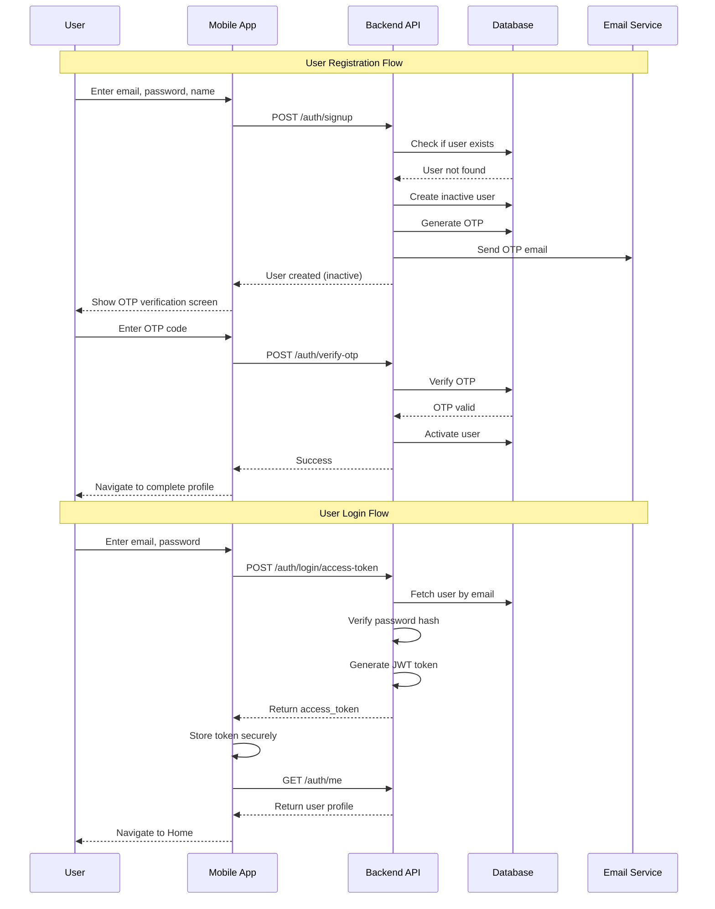
```mermaid
sequenceDiagram
    participant U as User
    participant MA as Mobile App
    participant API as Backend API
    participant DB as Database
    participant Email as Email Service

    Note over U,Email: User Registration Flow
    
    U->>MA: Enter email, password, name
    MA->>API: POST /auth/signup
    API->>DB: Check if user exists
    DB-->>API: User not found
    API->>DB: Create inactive user
    API->>DB: Generate OTP
    API->>Email: Send OTP email
    API-->>MA: User created (inactive)
    MA-->>U: Show OTP verification screen

    U->>MA: Enter OTP code
    MA->>API: POST /auth/verify-otp
    API->>DB: Verify OTP
    DB-->>API: OTP valid
    API->>DB: Activate user
    API-->>MA: Success
    MA-->>U: Navigate to complete profile

    Note over U,Email: User Login Flow

    U->>MA: Enter email, password
    MA->>API: POST /auth/login/access-token
    API->>DB: Fetch user by email
    API->>API: Verify password hash
    API->>API: Generate JWT token
    API-->>MA: Return access_token
    MA->>MA: Store token securely
    MA->>API: GET /auth/me
    API-->>MA: Return user profile
    MA-->>U: Navigate to Home
```

## 5.2 Content Creation Flow

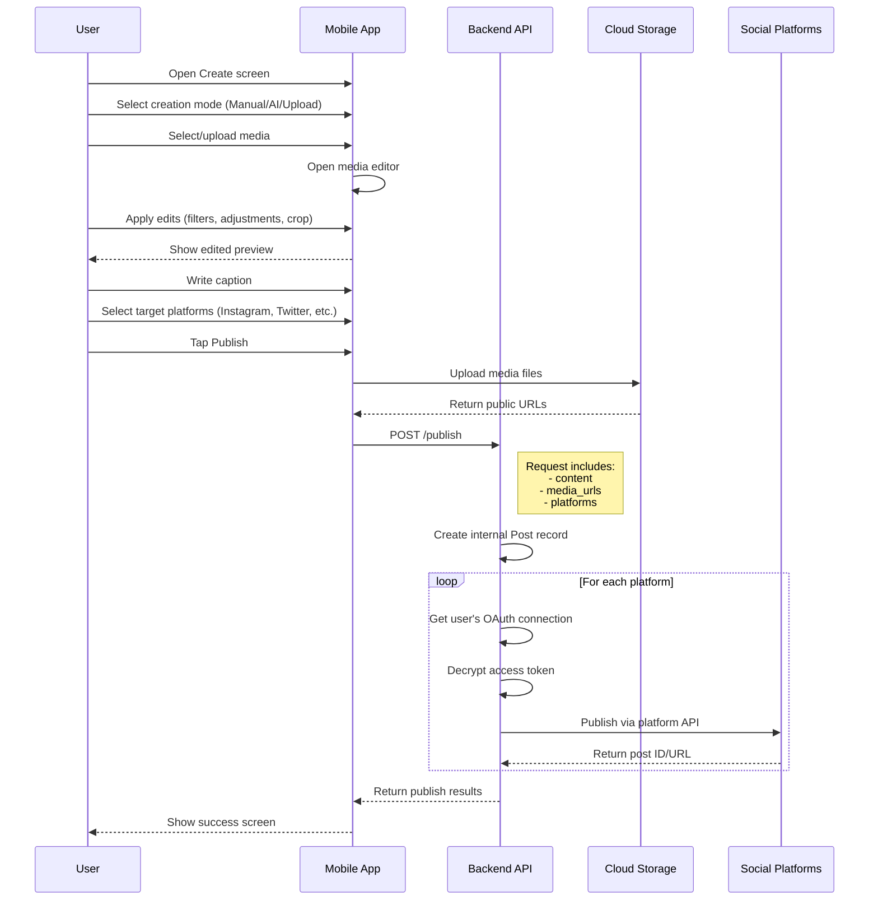
```mermaid
sequenceDiagram
    participant U as User
    participant MA as Mobile App
    participant API as Backend API
    participant GCS as Cloud Storage
    participant SP as Social Platforms

    U->>MA: Open Create screen
    U->>MA: Select creation mode (Manual/AI/Upload)
    U->>MA: Select/upload media
    MA->>MA: Open media editor
    U->>MA: Apply edits (filters, adjustments, crop)
    MA-->>U: Show edited preview

    U->>MA: Write caption
    U->>MA: Select target platforms (Instagram, Twitter, etc.)
    U->>MA: Tap Publish

    MA->>GCS: Upload media files
    GCS-->>MA: Return public URLs

    MA->>API: POST /publish
    Note right of API: Request includes:<br/>- content<br/>- media_urls<br/>- platforms

    API->>API: Create internal Post record
    
    loop For each platform
        API->>API: Get user's OAuth connection
        API->>API: Decrypt access token
        API->>SP: Publish via platform API
        SP-->>API: Return post ID/URL
    end

    API-->>MA: Return publish results
    MA-->>U: Show success screen
```

## 5.3 Social Publishing Flow

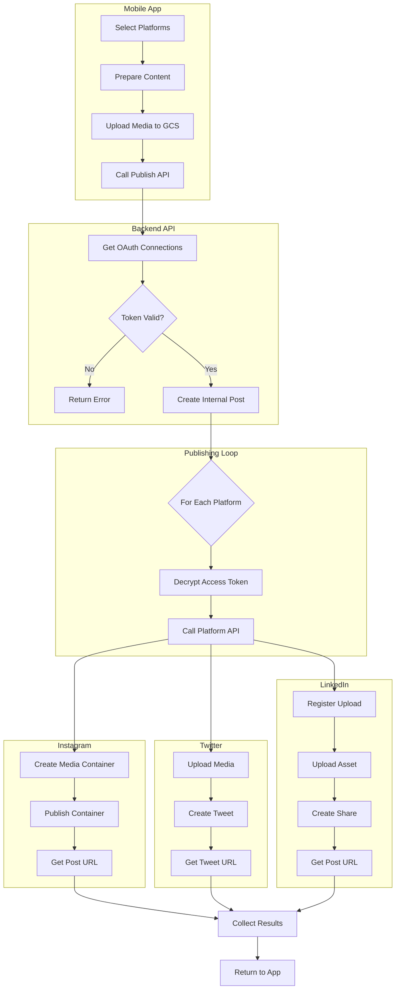
```mermaid
flowchart TB
    subgraph App["Mobile App"]
        A[Select Platforms] --> B[Prepare Content]
        B --> C[Upload Media to GCS]
        C --> D[Call Publish API]
    end

    subgraph Backend["Backend API"]
        D --> E[Get OAuth Connections]
        E --> F{Token Valid?}
        F -->|No| G[Return Error]
        F -->|Yes| H[Create Internal Post]
    end

    subgraph "Publishing Loop"
        H --> I{For Each Platform}
        I --> J[Decrypt Access Token]
        J --> K[Call Platform API]
    end

    subgraph Instagram
        K --> L1[Create Media Container]
        L1 --> L2[Publish Container]
        L2 --> L3[Get Post URL]
    end

    subgraph Twitter
        K --> T1[Upload Media]
        T1 --> T2[Create Tweet]
        T2 --> T3[Get Tweet URL]
    end

    subgraph LinkedIn
        K --> N1[Register Upload]
        N1 --> N2[Upload Asset]
        N2 --> N3[Create Share]
        N3 --> N4[Get Post URL]
    end

    L3 --> R[Collect Results]
    T3 --> R
    N4 --> R
    R --> S[Return to App]
```

## 5.4 Real-time Chat Flow

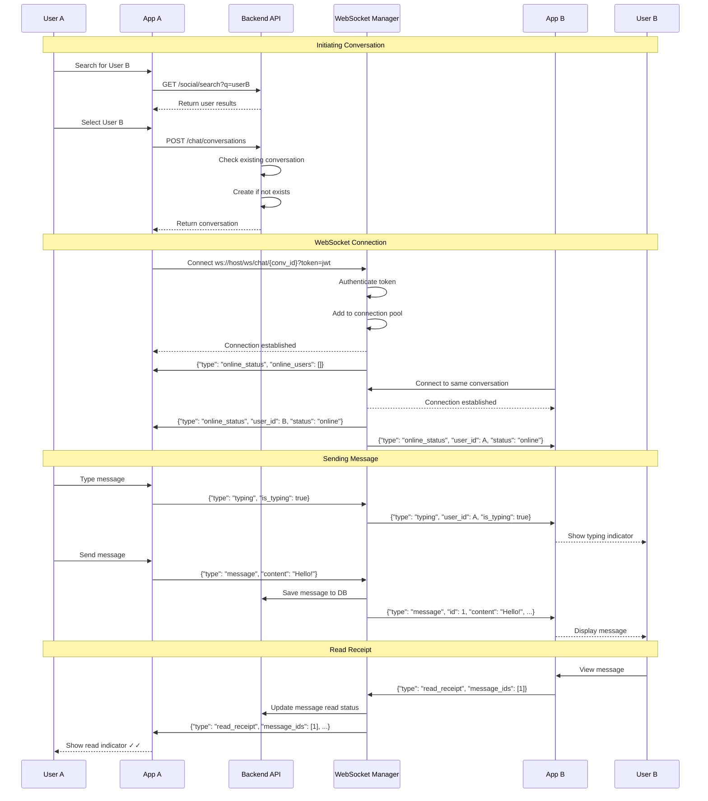
```mermaid
sequenceDiagram
    participant U1 as User A
    participant MA1 as App A
    participant API as Backend API
    participant WS as WebSocket Manager
    participant MA2 as App B
    participant U2 as User B

    Note over U1,U2: Initiating Conversation

    U1->>MA1: Search for User B
    MA1->>API: GET /social/search?q=userB
    API-->>MA1: Return user results
    U1->>MA1: Select User B
    MA1->>API: POST /chat/conversations
    API->>API: Check existing conversation
    API->>API: Create if not exists
    API-->>MA1: Return conversation

    Note over U1,U2: WebSocket Connection

    MA1->>WS: Connect ws://host/ws/chat/{conv_id}?token=jwt
    WS->>WS: Authenticate token
    WS->>WS: Add to connection pool
    WS-->>MA1: Connection established
    WS->>MA1: {"type": "online_status", "online_users": []}

    MA2->>WS: Connect to same conversation
    WS-->>MA2: Connection established
    WS->>MA1: {"type": "online_status", "user_id": B, "status": "online"}
    WS->>MA2: {"type": "online_status", "user_id": A, "status": "online"}

    Note over U1,U2: Sending Message

    U1->>MA1: Type message
    MA1->>WS: {"type": "typing", "is_typing": true}
    WS->>MA2: {"type": "typing", "user_id": A, "is_typing": true}
    MA2-->>U2: Show typing indicator

    U1->>MA1: Send message
    MA1->>WS: {"type": "message", "content": "Hello!"}
    WS->>API: Save message to DB
    WS->>MA2: {"type": "message", "id": 1, "content": "Hello!", ...}
    MA2-->>U2: Display message

    Note over U1,U2: Read Receipt

    U2->>MA2: View message
    MA2->>WS: {"type": "read_receipt", "message_ids": [1]}
    WS->>API: Update message read status
    WS->>MA1: {"type": "read_receipt", "message_ids": [1], ...}
    MA1-->>U1: Show read indicator ✓✓
```

---

# 6. Entity Relationships

## 6.1 ER Diagram

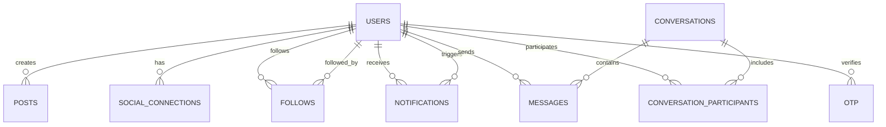
```mermaid
erDiagram
    USERS ||--o{ POSTS : "creates"
    USERS ||--o{ SOCIAL_CONNECTIONS : "has"
    USERS ||--o{ FOLLOWS : "follows"
    USERS ||--o{ FOLLOWS : "followed_by"
    USERS ||--o{ NOTIFICATIONS : "receives"
    USERS ||--o{ NOTIFICATIONS : "triggers"
    USERS ||--o{ MESSAGES : "sends"
    USERS ||--o{ CONVERSATION_PARTICIPANTS : "participates"
    CONVERSATIONS ||--o{ MESSAGES : "contains"
    CONVERSATIONS ||--o{ CONVERSATION_PARTICIPANTS : "includes"
    USERS ||--o{ OTP : "verifies"
```

## 6.2 Model Descriptions

### User Model

The central entity representing registered users.

| Field | Type | Description |
|-------|------|-------------|
| `id` | Integer (PK) | Unique identifier |
| `email` | String (Unique) | User's email address |
| `username` | String (Unique) | Display username |
| `full_name` | String | Full name |
| `hashed_password` | String | Bcrypt password hash |
| `is_active` | Boolean | Account activation status |
| `profile_picture` | String | GCS URL for profile image |
| `bio` | String | User bio/description |
| `instagram/linkedin/twitter/facebook` | String | Social media links |
| `posts_count` | Integer | Counter cache for posts |
| `followers_count` | Integer | Counter cache for followers |
| `following_count` | Integer | Counter cache for following |
| `fcm_token` | String | Firebase push token |

### Post Model

Content created and published by users.

| Field | Type | Description |
|-------|------|-------------|
| `id` | Integer (PK) | Unique identifier |
| `user_id` | Integer (FK) | Reference to User |
| `content` | Text | Post caption/text |
| `media_urls` | JSON | List of media URLs |
| `platforms` | JSON | Target platforms list |
| `created_at` | Timestamp | Creation time |
| `published_at` | Timestamp | Publication time |
| `likes_count` | Integer | Like counter |
| `comments_count` | Integer | Comment counter |

### Social Connection Model

OAuth tokens for connected social platforms.

| Field | Type | Description |
|-------|------|-------------|
| `id` | Integer (PK) | Unique identifier |
| `user_id` | Integer (FK) | Reference to User |
| `platform` | String | Platform identifier |
| `platform_user_id` | String | User ID on platform |
| `platform_username` | String | Username on platform |
| `access_token` | Text (Encrypted) | OAuth access token |
| `refresh_token` | Text (Encrypted) | OAuth refresh token |
| `token_expires_at` | Timestamp | Token expiration |
| `scopes` | Text | Granted permissions |

### Follow Model

Asymmetric follow relationships between users.

| Field | Type | Description |
|-------|------|-------------|
| `id` | Integer (PK) | Unique identifier |
| `follower_id` | Integer (FK) | User who follows |
| `following_id` | Integer (FK) | User being followed |
| `created_at` | Timestamp | When follow occurred |

**Constraint**: `UNIQUE(follower_id, following_id)`

### Conversation Model

Chat conversations between users (1:1 only).

| Field | Type | Description |
|-------|------|-------------|
| `id` | Integer (PK) | Unique identifier |
| `created_at` | Timestamp | Creation time |
| `updated_at` | Timestamp | Last update time |
| `last_message_at` | Timestamp | Time of last message |

### Message Model

Individual chat messages.

| Field | Type | Description |
|-------|------|-------------|
| `id` | Integer (PK) | Unique identifier |
| `conversation_id` | Integer (FK) | Parent conversation |
| `sender_id` | Integer (FK) | Message sender |
| `content` | Text | Message text |
| `message_type` | Enum | text, image, video |
| `media_url` | String | Media attachment URL |
| `created_at` | Timestamp | Send time |
| `is_read` | Boolean | Read status |
| `read_at` | Timestamp | When read |

### Notification Model

User notifications for various events.

| Field | Type | Description |
|-------|------|-------------|
| `id` | Integer (PK) | Unique identifier |
| `user_id` | Integer (FK) | Notification recipient |
| `actor_id` | Integer (FK) | User who triggered |
| `type` | Enum | follow, like, comment, system, ai |
| `title` | String | Notification title |
| `message` | String | Notification content |
| `related_id` | Integer | Related entity ID |
| `related_type` | String | Related entity type |
| `is_read` | Boolean | Read status |

---

# 7. Module Specifications

## 7.1 Authentication Module

### Purpose
Handle user registration, login, password management, and session authentication.

### Endpoints

| Method | Endpoint | Description |
|--------|----------|-------------|
| POST | `/auth/signup` | Register new user |
| POST | `/auth/login/access-token` | Login and get JWT |
| GET | `/auth/me` | Get current user profile |
| POST | `/auth/forgot-password` | Request password reset OTP |
| POST | `/auth/verify-otp` | Verify OTP code |
| POST | `/auth/reset-password` | Reset password with OTP |
| PUT | `/auth/change-password` | Change password (authenticated) |

### Security Features

1. **Password Hashing**: Bcrypt with automatic salt generation
2. **JWT Tokens**: HS256 signed tokens with configurable expiration
3. **OTP Verification**: 6-digit codes with 10-minute expiry
4. **Email Validation**: OTP sent via email for account activation

### Flow Diagram

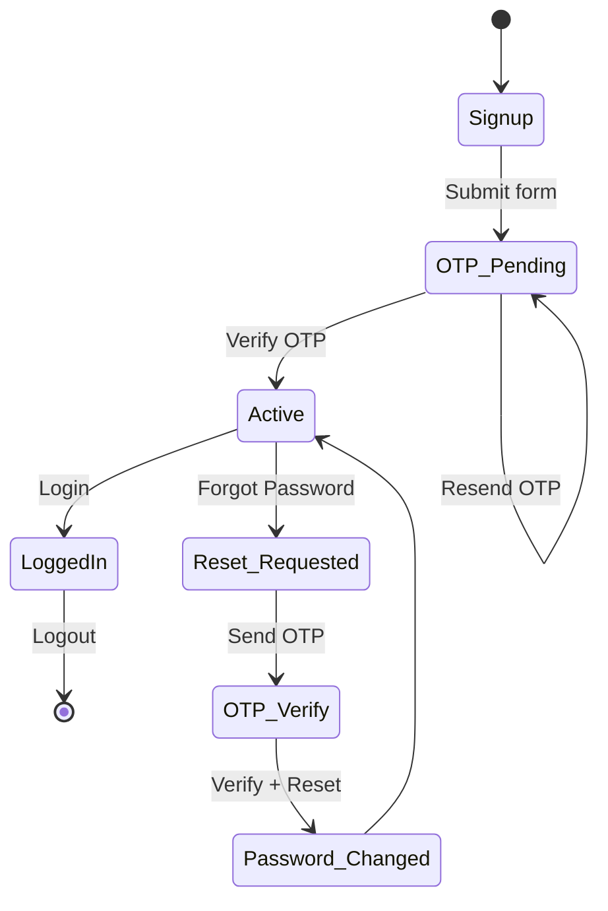
```mermaid
stateDiagram-v2
    [*] --> Signup
    Signup --> OTP_Pending: Submit form
    OTP_Pending --> Active: Verify OTP
    OTP_Pending --> OTP_Pending: Resend OTP
    
    Active --> LoggedIn: Login
    LoggedIn --> [*]: Logout
    
    Active --> Reset_Requested: Forgot Password
    Reset_Requested --> OTP_Verify: Send OTP
    OTP_Verify --> Password_Changed: Verify + Reset
    Password_Changed --> Active
```

## 7.2 Content Creation Module

### Purpose
Enable users to create, edit, and manage content for publishing.

### Components

#### Mobile App Screens

| Screen | Purpose |
|--------|---------|
| `SelectModeScreen` | Choose creation mode (Create with AI, Upload Media, Write Text) |
| `SelectMediaScreen` | Pick images/videos from gallery |
| `EditMediaScreen` | Advanced media editing (filters, adjustments, crop) |
| `CraftPostScreen` | Write caption, add hashtags |
| `AiGenerationScreen` | AI-assisted content generation |
| `ReviewPublishScreen` | Final review and platform selection |
| `PublishedSuccessScreen` | Confirmation after publishing |

#### Media Editor Features

| Feature | Description |
|---------|-------------|
| Filters | Preset filters (Clarendon, Juno, Lark, etc.) |
| Brightness | -100 to +100 adjustment |
| Contrast | -100 to +100 adjustment |
| Saturation | -100 to +100 adjustment |
| Warmth | -100 to +100 adjustment |
| Crop | Multiple aspect ratios (1:1, 4:5, 16:9, etc.) |

### State Management

```dart
class CreationProvider extends ChangeNotifier {
  CreationMode? _selectedMode;
  MediaType? _selectedMediaType;
  List<XFile> _selectedMedia = [];
  String? _caption;
  List<String> _selectedPlatforms = [];
  
  // Navigation flow control
  void setMode(CreationMode mode) { ... }
  void setMediaType(MediaType type) { ... }
  void addMedia(List<XFile> files) { ... }
  void setCaption(String caption) { ... }
  void selectPlatforms(List<String> platforms) { ... }
}
```

## 7.3 Social Media Integration Module

### Purpose
Connect to social platforms via OAuth and publish content.

### Supported Platforms

| Platform | OAuth Version | Features |
|----------|---------------|----------|
| Instagram | OAuth 2.0 (Meta Graph API) | Image posts, Carousels |
| Twitter/X | OAuth 2.0 (PKCE) | Tweets, Images, Videos |
| LinkedIn | OAuth 2.0 | Posts, Images |
| Facebook | OAuth 2.0 (Meta Graph API) | Page posts, Images |

### OAuth Flow

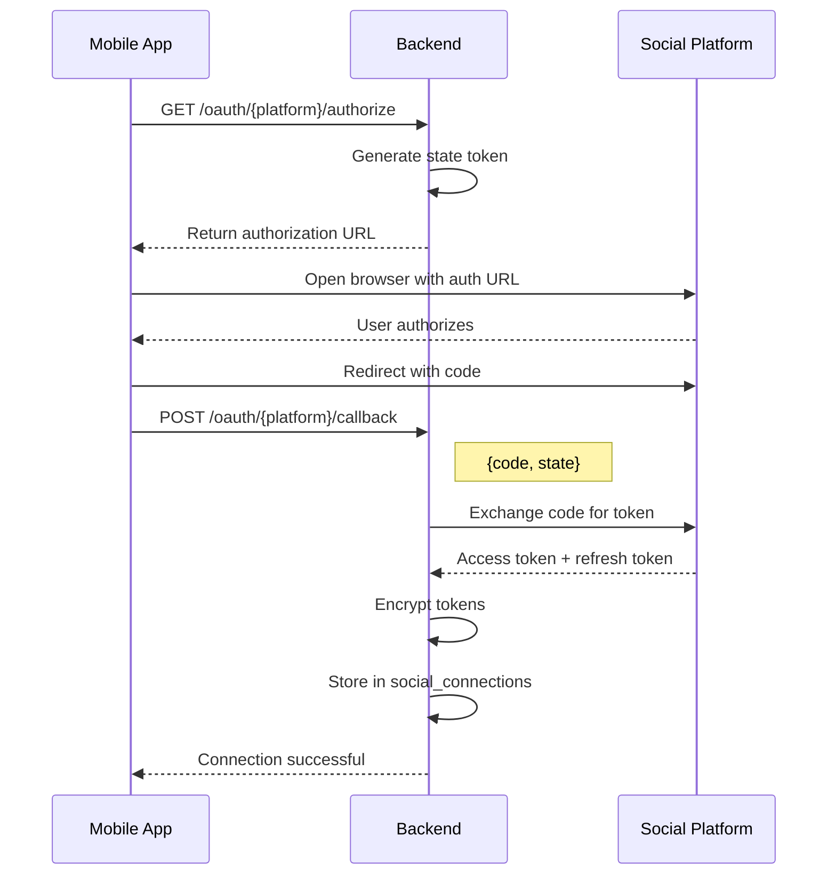
```mermaid
sequenceDiagram
    participant App as Mobile App
    participant API as Backend
    participant Platform as Social Platform

    App->>API: GET /oauth/{platform}/authorize
    API->>API: Generate state token
    API-->>App: Return authorization URL
    
    App->>Platform: Open browser with auth URL
    Platform-->>App: User authorizes
    App->>Platform: Redirect with code
    
    App->>API: POST /oauth/{platform}/callback
    Note right of API: {code, state}
    
    API->>Platform: Exchange code for token
    Platform-->>API: Access token + refresh token
    
    API->>API: Encrypt tokens
    API->>API: Store in social_connections
    API-->>App: Connection successful
```

### Platform-Specific Implementation

#### Instagram Service

```python
class InstagramService(BaseSocialService):
    SCOPES = [
        "instagram_basic",
        "instagram_content_publish",
        "pages_show_list",
        "pages_read_engagement",
    ]
    
    async def publish_post(self, access_token, content, media_urls):
        # 1. Get Instagram Business Account
        ig_account = await self._get_instagram_account(client, access_token)
        
        # 2. Create media container
        container = await client.post(
            f"{GRAPH_API}/{ig_account['id']}/media",
            params={"image_url": media_urls[0], "caption": content}
        )
        
        # 3. Publish container
        result = await client.post(
            f"{GRAPH_API}/{ig_account['id']}/media_publish",
            params={"creation_id": container["id"]}
        )
        
        return {"post_id": result["id"], "url": f"instagram.com/p/{result['id']}"}
```

## 7.4 Real-time Chat Module

### Purpose
Enable real-time messaging between users.

### Components

#### Backend

| Component | Purpose |
|-----------|---------|
| `ConnectionManager` | Track WebSocket connections |
| `websocket_chat` | WebSocket endpoint handler |
| `chat.py` endpoints | REST API for conversations/messages |

#### Message Types

| Type | Direction | Purpose |
|------|-----------|---------|
| `message` | Bidirectional | Send/receive chat messages |
| `read_receipt` | Bidirectional | Mark messages as read |
| `typing` | Bidirectional | Typing indicators |
| `online_status` | Server → Client | User presence updates |

### WebSocket Protocol

```json
// Client → Server: Send message
{
  "type": "message",
  "content": "Hello!",
  "message_type": "text"
}

// Server → Client: New message
{
  "type": "message",
  "id": 123,
  "sender_id": 1,
  "sender": {
    "id": 1,
    "username": "john",
    "profile_picture": "https://..."
  },
  "content": "Hello!",
  "message_type": "text",
  "created_at": "2024-01-15T10:30:00Z",
  "is_read": false
}

// Client → Server: Read receipt
{
  "type": "read_receipt",
  "message_ids": [123, 124, 125]
}

// Client → Server: Typing indicator
{
  "type": "typing",
  "is_typing": true
}
```

### Connection Manager

```python
class ConnectionManager:
    def __init__(self):
        # conversation_id -> {user_id -> WebSocket}
        self.active_connections: Dict[int, Dict[int, WebSocket]] = {}
    
    async def connect(self, websocket, conversation_id, user_id):
        await websocket.accept()
        if conversation_id not in self.active_connections:
            self.active_connections[conversation_id] = {}
        self.active_connections[conversation_id][user_id] = websocket
    
    async def broadcast_to_conversation(self, message, conversation_id, exclude_user_id=None):
        if conversation_id in self.active_connections:
            for user_id, websocket in self.active_connections[conversation_id].items():
                if user_id != exclude_user_id:
                    await websocket.send_json(message)
```

## 7.5 Notification Module

### Purpose
Deliver in-app and push notifications for various events.

### Notification Types

| Type | Trigger | Example |
|------|---------|---------|
| `follow` | User follows another | "john started following you" |
| `like` | User likes a post | "john liked your post" |
| `comment` | User comments on post | "john commented on your post" |
| `mention` | User mentioned in content | "john mentioned you" |
| `system` | System announcements | "Welcome to Vextra!" |
| `ai` | AI content ready | "Your AI content is ready" |

### Push Notification Flow

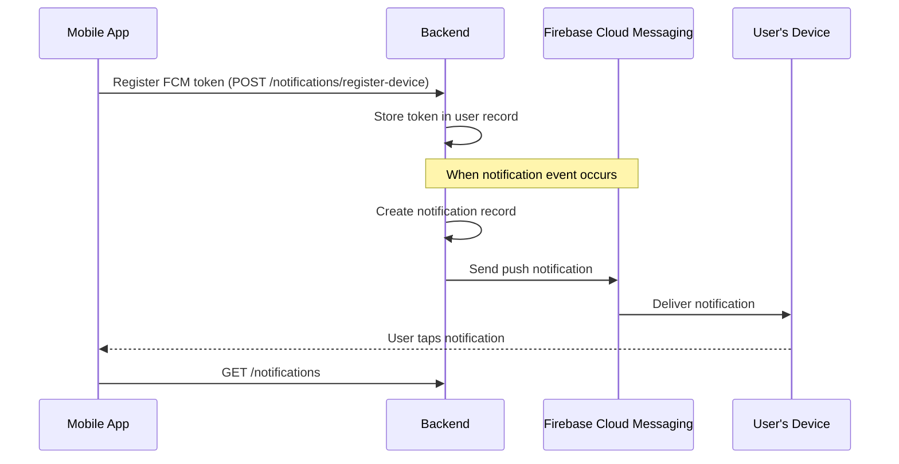
```mermaid
sequenceDiagram
    participant App as Mobile App
    participant API as Backend
    participant FCM as Firebase Cloud Messaging
    participant Device as User's Device

    App->>API: Register FCM token (POST /notifications/register-device)
    API->>API: Store token in user record

    Note over API,FCM: When notification event occurs

    API->>API: Create notification record
    API->>FCM: Send push notification
    FCM->>Device: Deliver notification
    Device-->>App: User taps notification
    App->>API: GET /notifications
```

### Endpoints

| Method | Endpoint | Description |
|--------|----------|-------------|
| GET | `/notifications` | Get paginated notifications |
| GET | `/notifications/unread-count` | Get unread count |
| PUT | `/notifications/{id}/read` | Mark as read |
| PUT | `/notifications/read-all` | Mark all as read |
| DELETE | `/notifications/{id}` | Delete notification |
| POST | `/notifications/register-device` | Register FCM token |

## 7.6 Social Network Module

### Purpose
Enable social interactions between users (follow, search, profiles).

### Features

| Feature | Description |
|---------|-------------|
| Follow/Unfollow | Asymmetric following (like Instagram) |
| User Search | Search by username or full name |
| Public Profiles | View other users' profiles |
| Followers List | See who follows a user |
| Following List | See who a user follows |

### Follow System

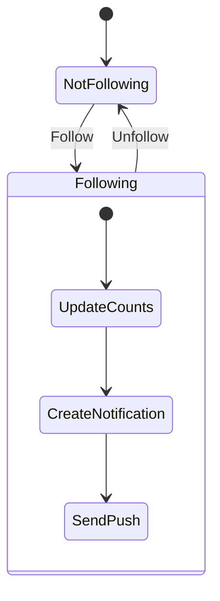
```mermaid
stateDiagram-v2
    [*] --> NotFollowing
    NotFollowing --> Following: Follow
    Following --> NotFollowing: Unfollow
    
    state Following {
        [*] --> UpdateCounts
        UpdateCounts --> CreateNotification
        CreateNotification --> SendPush
    }
```

### Endpoints

| Method | Endpoint | Description |
|--------|----------|-------------|
| POST | `/social/follow/{user_id}` | Follow a user |
| DELETE | `/social/follow/{user_id}` | Unfollow a user |
| GET | `/social/follow-status/{user_id}` | Check follow status |
| GET | `/social/followers/{user_id}` | Get user's followers |
| GET | `/social/following/{user_id}` | Get user's following |
| GET | `/social/search` | Search users |
| GET | `/social/profile/{username}` | Get public profile |

---

# 8. Security Implementation

## Authentication & Authorization

### JWT Token Structure

```json
{
  "exp": 1705312800,
  "sub": "123"
}
```

- **exp**: Token expiration timestamp
- **sub**: User ID (subject)

### Token Configuration

| Setting | Value |
|---------|-------|
| Algorithm | HS256 |
| Expiration | 8 days (configurable) |
| Secret Key | Environment variable |

### Password Security

```python
pwd_context = CryptContext(schemes=["bcrypt"], deprecated="auto")

def get_password_hash(password: str) -> str:
    return pwd_context.hash(password)

def verify_password(plain_password: str, hashed_password: str) -> bool:
    return pwd_context.verify(plain_password, hashed_password)
```

## OAuth Token Encryption

Social platform tokens are encrypted at rest using the `cryptography` library:

```python
from cryptography.fernet import Fernet

def encrypt_token(token: str) -> str:
    """Encrypt OAuth token before storing"""
    key = settings.SECRET_KEY.encode()[:32]  # Use first 32 bytes
    f = Fernet(base64.urlsafe_b64encode(key))
    return f.encrypt(token.encode()).decode()

def decrypt_token(encrypted_token: str) -> str:
    """Decrypt OAuth token for use"""
    key = settings.SECRET_KEY.encode()[:32]
    f = Fernet(base64.urlsafe_b64encode(key))
    return f.decrypt(encrypted_token.encode()).decode()
```

## API Security

### CORS Configuration

```python
app.add_middleware(
    CORSMiddleware,
    allow_origins=[str(origin) for origin in settings.BACKEND_CORS_ORIGINS],
    allow_credentials=True,
    allow_methods=["*"],
    allow_headers=["*"],
)
```

### Secure Storage (Mobile)

```dart
final _storage = const FlutterSecureStorage();

// Store token securely
await _storage.write(key: 'access_token', value: token);

// Retrieve token
final token = await _storage.read(key: 'access_token');
```

---

# 9. Deployment Architecture

## Google Cloud Platform Setup

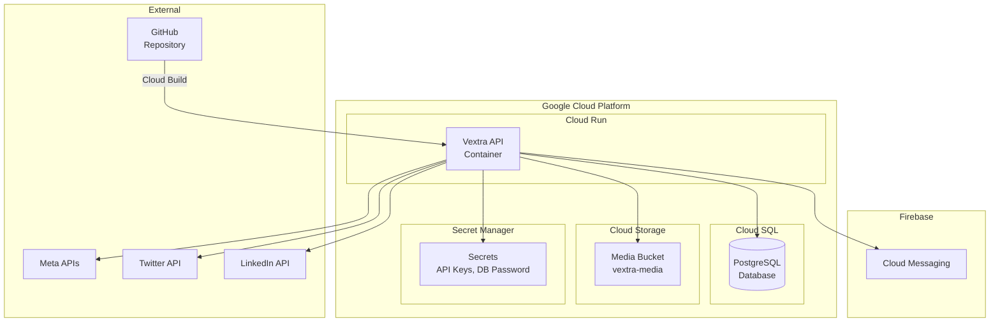
```mermaid
graph TB
    subgraph "Google Cloud Platform"
        subgraph "Cloud Run"
            CR[Vextra API<br/>Container]
        end
        
        subgraph "Cloud SQL"
            DB[(PostgreSQL<br/>Database)]
        end
        
        subgraph "Cloud Storage"
            GCS[Media Bucket<br/>vextra-media]
        end
        
        subgraph "Secret Manager"
            SM[Secrets<br/>API Keys, DB Password]
        end
    end
    
    subgraph "Firebase"
        FCM[Cloud Messaging]
    end
    
    subgraph "External"
        GH[GitHub<br/>Repository]
        META[Meta APIs]
        TW[Twitter API]
        LI[LinkedIn API]
    end
    
    GH -->|Cloud Build| CR
    CR --> DB
    CR --> GCS
    CR --> SM
    CR --> FCM
    CR --> META
    CR --> TW
    CR --> LI
```

## Dockerfile

```dockerfile
FROM python:3.10-slim

WORKDIR /code

# Install dependencies
COPY ./requirements.txt /code/requirements.txt
RUN pip install --no-cache-dir --upgrade -r /code/requirements.txt

# Copy application code
COPY ./app /code/app
COPY ./alembic /code/alembic
COPY ./alembic.ini /code/alembic.ini
COPY ./entrypoint.sh /code/entrypoint.sh

RUN chmod +x /code/entrypoint.sh

EXPOSE 8080

ENTRYPOINT ["/code/entrypoint.sh"]
```

## Environment Variables

| Variable | Description |
|----------|-------------|
| `DATABASE_URL` | PostgreSQL connection string |
| `SECRET_KEY` | JWT signing key |
| `GCS_BUCKET_NAME` | Cloud Storage bucket |
| `MAIL_USERNAME` | SMTP username |
| `MAIL_PASSWORD` | SMTP password |
| `META_APP_ID` | Facebook App ID |
| `META_APP_SECRET` | Facebook App Secret |
| `TWITTER_CLIENT_ID` | Twitter OAuth client |
| `LINKEDIN_CLIENT_ID` | LinkedIn OAuth client |

---

# 10. API Reference

## Base URL

```
Production: https://vextra-api-xxxxx.run.app/api/v1
Local: http://localhost:8000/api/v1
```

## Authentication

### Login

```http
POST /auth/login/access-token
Content-Type: application/x-www-form-urlencoded

username=user@example.com&password=secret
```

**Response:**
```json
{
  "access_token": "eyJhbGciOiJIUzI1NiIsInR5cCI6IkpXVCJ9...",
  "token_type": "bearer"
}
```

### Signup

```http
POST /auth/signup
Content-Type: application/json

{
  "email": "user@example.com",
  "password": "securePassword123",
  "full_name": "John Doe"
}
```

### Get Current User

```http
GET /auth/me
Authorization: Bearer {token}
```

## Social Connections

### List Connections

```http
GET /oauth/connections
Authorization: Bearer {token}
```

**Response:**
```json
{
  "connections": [
    {
      "platform": "instagram",
      "platform_username": "johndoe",
      "platform_display_name": "John Doe",
      "connected_at": "2024-01-15T10:00:00Z",
      "is_expired": false
    }
  ]
}
```

### Get Authorization URL

```http
GET /oauth/{platform}/authorize
Authorization: Bearer {token}
```

**Response:**
```json
{
  "authorization_url": "https://www.facebook.com/v18.0/dialog/oauth?...",
  "state": "abc123..."
}
```

## Publishing

### Publish Content

```http
POST /publish/
Authorization: Bearer {token}
Content-Type: application/json

{
  "content": "Check out this amazing content! #vextra",
  "media_urls": ["https://storage.googleapis.com/vextra/image.jpg"],
  "platforms": ["instagram", "twitter"]
}
```

**Response:**
```json
{
  "success": true,
  "results": {
    "instagram": {
      "success": true,
      "post_id": "17841405822304914",
      "url": "https://www.instagram.com/p/..."
    },
    "twitter": {
      "success": true,
      "post_id": "1612345678901234567",
      "url": "https://twitter.com/user/status/..."
    }
  }
}
```

## Chat

### Create/Get Conversation

```http
POST /chat/conversations
Authorization: Bearer {token}
Content-Type: application/json

{
  "participant_id": 42
}
```

### Send Message

```http
POST /chat/conversations/{id}/messages
Authorization: Bearer {token}
Content-Type: application/json

{
  "content": "Hello!",
  "message_type": "text"
}
```

### WebSocket Connection

```
wss://host/api/v1/ws/chat/{conversation_id}?token={jwt_token}
```

---

# 11. Testing Strategy

## Backend Testing

### Unit Tests

```python
# tests/test_auth.py
def test_create_user():
    response = client.post("/auth/signup", json={
        "email": "test@example.com",
        "password": "password123",
        "full_name": "Test User"
    })
    assert response.status_code == 200
    assert response.json()["email"] == "test@example.com"

def test_login():
    response = client.post("/auth/login/access-token", data={
        "username": "test@example.com",
        "password": "password123"
    })
    assert response.status_code == 200
    assert "access_token" in response.json()
```

### Integration Tests

- OAuth flow testing with mock servers
- WebSocket connection tests
- Database transaction tests

## Frontend Testing

### Widget Tests

```dart
testWidgets('Login screen displays form', (WidgetTester tester) async {
  await tester.pumpWidget(MaterialApp(home: LoginScreen()));
  
  expect(find.byType(TextField), findsNWidgets(2));
  expect(find.text('Login'), findsOneWidget);
});
```

### Integration Tests

- Full authentication flow
- Content creation flow
- Chat functionality

---

# 12. Future Enhancements

## Planned Features

### Version 2.0

| Feature | Description | Priority |
|---------|-------------|----------|
| Post Scheduling | Schedule posts for future publication | High |
| Analytics Dashboard | View post performance metrics | High |
| AI Image Generation | Generate images from text prompts | Medium |
| Team Collaboration | Invite team members | Medium |
| Content Calendar | Visual calendar for scheduled posts | Medium |

### Version 3.0

| Feature | Description |
|---------|-------------|
| Multi-language Support | i18n for global users |
| Threads Integration | Publish to Meta Threads |
| TikTok Integration | Video publishing to TikTok |
| Advanced AI | AI-powered content suggestions |
| Desktop App | Cross-platform desktop client |

## Complete AI Workflow (Future Implementation)

### Overview

The AI Content Generation Workflow is a comprehensive system designed to automate and enhance content creation using artificial intelligence. This feature will enable users to generate complete social media posts including text, images, and optimized hashtags with minimal manual input.

### AI Workflow Architecture

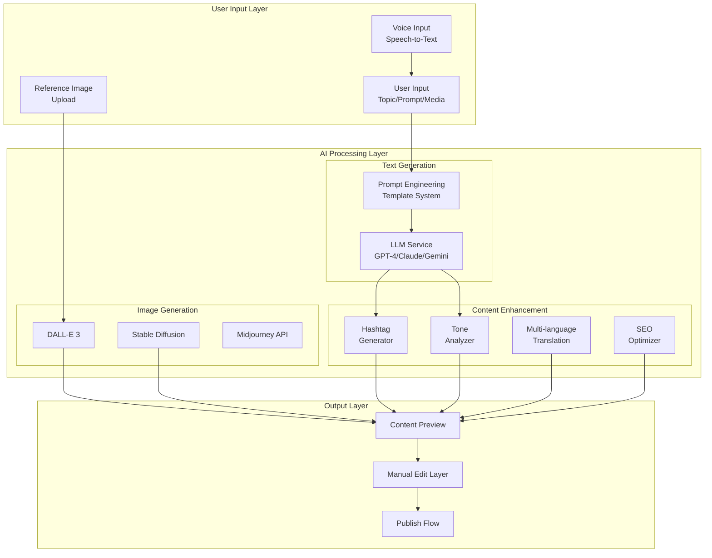
```mermaid
graph TB
    subgraph "User Input Layer"
        UI[User Input<br/>Topic/Prompt/Media]
        VOICE[Voice Input<br/>Speech-to-Text]
        IMG[Reference Image<br/>Upload]
    end
    
    subgraph "AI Processing Layer"
        subgraph "Text Generation"
            GPT[LLM Service<br/>GPT-4/Claude/Gemini]
            PROMPT[Prompt Engineering<br/>Template System]
        end
        
        subgraph "Image Generation"
            DALLE[DALL-E 3]
            SD[Stable Diffusion]
            MJ[Midjourney API]
        end
        
        subgraph "Content Enhancement"
            HASH[Hashtag<br/>Generator]
            TONE[Tone<br/>Analyzer]
            TRANS[Multi-language<br/>Translation]
            SEO[SEO<br/>Optimizer]
        end
    end
    
    subgraph "Output Layer"
        PREVIEW[Content Preview]
        EDIT[Manual Edit Layer]
        PUBLISH[Publish Flow]
    end
    
    UI --> PROMPT
    VOICE --> UI
    IMG --> DALLE
    PROMPT --> GPT
    GPT --> HASH
    GPT --> TONE
    DALLE --> PREVIEW
    SD --> PREVIEW
    HASH --> PREVIEW
    TONE --> PREVIEW
    TRANS --> PREVIEW
    SEO --> PREVIEW
    PREVIEW --> EDIT
    EDIT --> PUBLISH
```

### AI Workflow Data Flow

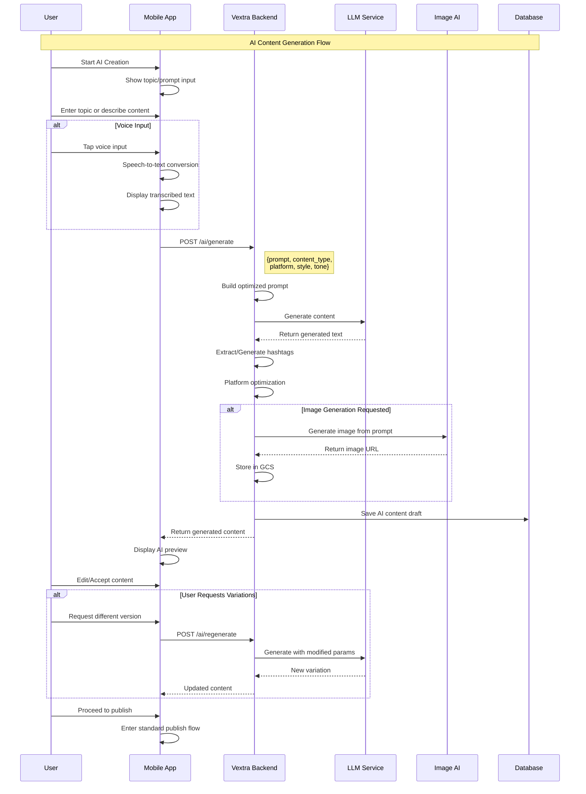
```mermaid
sequenceDiagram
    participant U as User
    participant App as Mobile App
    participant API as Vextra Backend
    participant LLM as LLM Service
    participant IMG as Image AI
    participant DB as Database

    Note over U,DB: AI Content Generation Flow

    U->>App: Start AI Creation
    App->>App: Show topic/prompt input
    U->>App: Enter topic or describe content
    
    alt Voice Input
        U->>App: Tap voice input
        App->>App: Speech-to-text conversion
        App->>App: Display transcribed text
    end
    
    App->>API: POST /ai/generate
    Note right of API: {prompt, content_type,<br/>platform, style, tone}
    
    API->>API: Build optimized prompt
    API->>LLM: Generate content
    LLM-->>API: Return generated text
    
    API->>API: Extract/Generate hashtags
    API->>API: Platform optimization
    
    alt Image Generation Requested
        API->>IMG: Generate image from prompt
        IMG-->>API: Return image URL
        API->>API: Store in GCS
    end
    
    API->>DB: Save AI content draft
    API-->>App: Return generated content
    
    App->>App: Display AI preview
    U->>App: Edit/Accept content
    
    alt User Requests Variations
        U->>App: Request different version
        App->>API: POST /ai/regenerate
        API->>LLM: Generate with modified params
        LLM-->>API: New variation
        API-->>App: Updated content
    end
    
    U->>App: Proceed to publish
    App->>App: Enter standard publish flow
```

### AI Module Components

#### 1. Prompt Engineering System

| Component | Description |
|-----------|-------------|
| Template Library | Pre-built prompts for different content types (promotional, educational, storytelling) |
| Context Injection | Inject brand voice, user preferences, and platform requirements |
| Dynamic Variables | Support for variables like {topic}, {brand}, {tone}, {length} |
| Chain-of-Thought | Multi-step prompting for complex content generation |

```python
# Example Prompt Template Structure
class PromptTemplate:
    def __init__(self, template_type: str):
        self.templates = {
            "promotional": """
                Create a {tone} social media post about {topic}.
                Brand voice: {brand_voice}
                Target platform: {platform}
                Include: Call-to-action, relevant emojis
                Character limit: {char_limit}
            """,
            "educational": """
                Write an informative {platform} post explaining {topic}.
                Style: {tone}, easy to understand
                Include: Key facts, expert tip, engaging question
            """,
            "storytelling": """
                Craft a compelling story-style post about {topic}.
                Narrative style: {tone}
                Hook the reader in first line
                End with engagement prompt
            """
        }
```

#### 2. Content Generation Service

```python
class AIContentService:
    """AI Content Generation Service"""
    
    async def generate_text(
        self,
        prompt: str,
        platform: str,
        tone: str = "professional",
        max_length: int = None,
        include_hashtags: bool = True,
        include_emojis: bool = True
    ) -> ContentGenerationResult:
        """Generate text content using LLM"""
        pass
    
    async def generate_image(
        self,
        prompt: str,
        style: str = "realistic",
        aspect_ratio: str = "1:1",
        quality: str = "standard"
    ) -> ImageGenerationResult:
        """Generate image using AI image service"""
        pass
    
    async def enhance_content(
        self,
        content: str,
        enhancement_type: str  # "expand", "shorten", "rephrase", "translate"
    ) -> str:
        """Enhance or modify existing content"""
        pass
    
    async def generate_hashtags(
        self,
        content: str,
        platform: str,
        count: int = 10,
        include_trending: bool = True
    ) -> List[str]:
        """Generate relevant hashtags"""
        pass
    
    async def analyze_content(
        self,
        content: str
    ) -> ContentAnalysis:
        """Analyze content for tone, sentiment, readability"""
        pass
```

#### 3. Image Generation Integration

| Provider | Use Case | Features |
|----------|----------|----------|
| DALL-E 3 | Primary image generation | High quality, prompt adherence |
| Stable Diffusion | Custom style images | Fine-tuned models, local hosting option |
| Midjourney | Artistic/Creative images | Unique aesthetic, high creativity |
| Canva API | Template-based designs | Brand templates, quick graphics |

```python
class ImageGenerationService:
    """Multi-provider image generation"""
    
    providers = {
        "dalle": DALLEProvider(),
        "stable_diffusion": StableDiffusionProvider(),
        "midjourney": MidjourneyProvider(),
        "canva": CanvaProvider()
    }
    
    async def generate(
        self,
        prompt: str,
        provider: str = "dalle",
        **kwargs
    ) -> GeneratedImage:
        """Generate image using specified provider"""
        provider_service = self.providers[provider]
        return await provider_service.generate(prompt, **kwargs)
```

### AI API Endpoints

| Method | Endpoint | Description |
|--------|----------|-------------|
| POST | `/ai/generate` | Generate complete content (text + optional image) |
| POST | `/ai/generate/text` | Generate text content only |
| POST | `/ai/generate/image` | Generate image from prompt |
| POST | `/ai/enhance` | Enhance existing content |
| POST | `/ai/hashtags` | Generate hashtags for content |
| POST | `/ai/translate` | Translate content to target language |
| POST | `/ai/analyze` | Analyze content tone/sentiment |
| GET | `/ai/templates` | Get available prompt templates |
| GET | `/ai/styles` | Get available image styles |
| POST | `/ai/variations` | Generate content variations |

### AI Request/Response Schemas

```python
# Request Schema
class AIGenerateRequest(BaseModel):
    prompt: str                          # User's topic or description
    content_type: str = "post"           # post, story, reel, thread
    platform: str = "instagram"          # Target platform
    tone: str = "professional"           # casual, professional, humorous, etc.
    include_image: bool = False          # Generate accompanying image
    image_style: str = "realistic"       # realistic, artistic, minimal, etc.
    max_length: int = None               # Character limit
    language: str = "en"                 # Output language
    brand_voice: Optional[str] = None    # Custom brand voice description
    reference_url: Optional[str] = None  # Reference image URL

# Response Schema
class AIGenerateResponse(BaseModel):
    success: bool
    content: GeneratedContent
    variations: Optional[List[str]] = None  # Alternative versions
    metadata: ContentMetadata

class GeneratedContent(BaseModel):
    text: str
    hashtags: List[str]
    image_url: Optional[str]
    suggested_platforms: List[str]
    estimated_engagement: float  # AI-predicted engagement score

class ContentMetadata(BaseModel):
    tokens_used: int
    generation_time_ms: int
    model_used: str
    confidence_score: float
```

### AI Workflow User Features

#### Content Generation Options

| Feature | Description |
|---------|-------------|
| Topic-based Generation | Enter a topic, AI generates full post |
| Image-to-Post | Upload image, AI describes and creates caption |
| Voice-to-Content | Speak your idea, AI transcribes and enhances |
| Thread Generator | Create multi-post threads from single topic |
| Story Sequence | Generate connected story slides |
| Carousel Creator | AI-generated multi-image carousel content |

#### Enhancement Tools

| Tool | Description |
|------|-------------|
| Expand | Make content longer with more details |
| Shorten | Condense content to fit platform limits |
| Rephrase | Change wording while keeping meaning |
| Translate | Convert to any supported language |
| Tone Shift | Adjust from casual to professional, etc. |
| Add Humor | Inject wit and humor into content |
| Add Stats | Include relevant statistics |
| Simplify | Make content easier to understand |

#### Smart Suggestions

- **Trending Topics**: AI suggests trending topics in user's niche
- **Best Posting Times**: AI recommends optimal posting times
- **Platform Optimization**: Auto-adjust content for each platform
- **A/B Variations**: Generate multiple versions for testing
- **Engagement Prediction**: Score content before posting

### AI Workflow State Diagram

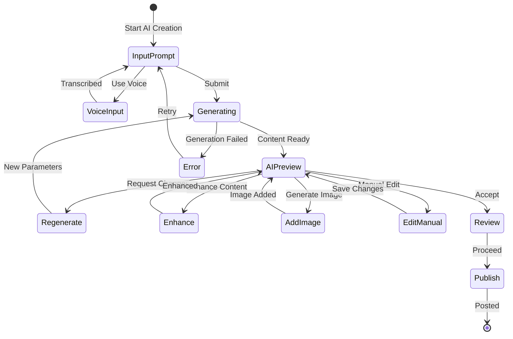
```mermaid
stateDiagram-v2
    [*] --> InputPrompt: Start AI Creation
    
    InputPrompt --> VoiceInput: Use Voice
    VoiceInput --> InputPrompt: Transcribed
    
    InputPrompt --> Generating: Submit
    
    Generating --> AIPreview: Content Ready
    Generating --> Error: Generation Failed
    Error --> InputPrompt: Retry
    
    AIPreview --> Regenerate: Request Changes
    Regenerate --> Generating: New Parameters
    
    AIPreview --> Enhance: Enhance Content
    Enhance --> AIPreview: Enhanced
    
    AIPreview --> AddImage: Generate Image
    AddImage --> AIPreview: Image Added
    
    AIPreview --> EditManual: Manual Edit
    EditManual --> AIPreview: Save Changes
    
    AIPreview --> Review: Accept
    Review --> Publish: Proceed
    Publish --> [*]: Posted
```

### Integration with Existing Modules

The AI Workflow integrates with existing Vextra modules:

| Module | Integration |
|--------|-------------|
| Content Creation | AI as additional creation mode alongside manual |
| Media Editor | AI-generated images flow into editor for refinement |
| Publishing | AI content follows standard publish flow |
| Social Connections | Platform-specific AI optimization |
| Notifications | Push notification when AI content is ready |
| Analytics (future) | Track AI vs manual content performance |

### AI Workflow Database Schema

```sql
-- AI Content Drafts
CREATE TABLE ai_content_drafts (
    id SERIAL PRIMARY KEY,
    user_id INTEGER REFERENCES users(id),
    prompt TEXT NOT NULL,
    generated_text TEXT,
    generated_hashtags JSON,
    generated_image_url TEXT,
    settings JSON,  -- tone, style, platform, etc.
    status VARCHAR(20),  -- 'generating', 'ready', 'published', 'discarded'
    tokens_used INTEGER,
    model_used VARCHAR(100),
    created_at TIMESTAMP DEFAULT NOW(),
    updated_at TIMESTAMP DEFAULT NOW()
);

-- AI Usage Tracking
CREATE TABLE ai_usage (
    id SERIAL PRIMARY KEY,
    user_id INTEGER REFERENCES users(id),
    request_type VARCHAR(50),  -- text, image, enhance, hashtags
    tokens_used INTEGER,
    cost_usd DECIMAL(10, 6),
    created_at TIMESTAMP DEFAULT NOW()
);

-- User AI Preferences
CREATE TABLE ai_preferences (
    user_id INTEGER PRIMARY KEY REFERENCES users(id),
    default_tone VARCHAR(50),
    default_style VARCHAR(50),
    brand_voice TEXT,
    preferred_hashtag_count INTEGER DEFAULT 10,
    favorite_templates JSON
);
```

### Cost Management

| Feature | Estimated Cost | User Limit (Free) | User Limit (Pro) |
|---------|----------------|-------------------|------------------|
| Text Generation | ~$0.002/request | 50/month | Unlimited |
| Image Generation | ~$0.04/image | 10/month | 100/month |
| Enhancement | ~$0.001/request | 100/month | Unlimited |
| Translation | ~$0.0005/request | 50/month | Unlimited |

## Technical Improvements

1. **Caching Layer**: Add Redis for session management and API caching
2. **CDN Integration**: Implement CloudFlare for faster media delivery
3. **Rate Limiting**: API throttling per user/endpoint
4. **Monitoring**: Add observability with Cloud Monitoring/Logging
5. **Background Jobs**: Celery for async task processing

---

## Infrastructure & Security Enhancements

### Asynchronous Task Queue Architecture

For handling long-running operations like multi-platform publishing, media processing, and AI content generation, an asynchronous task queue system will be implemented:

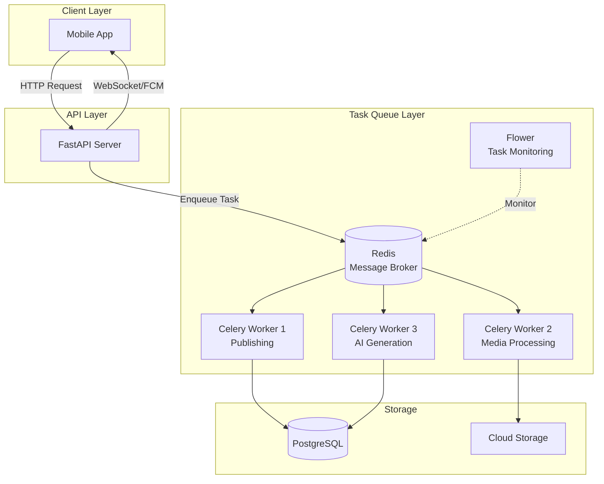
```mermaid
graph TB
    subgraph "Client Layer"
        APP[Mobile App]
    end
    
    subgraph "API Layer"
        API[FastAPI Server]
    end
    
    subgraph "Task Queue Layer"
        REDIS[(Redis<br/>Message Broker)]
        CW1[Celery Worker 1<br/>Publishing]
        CW2[Celery Worker 2<br/>Media Processing]
        CW3[Celery Worker 3<br/>AI Generation]
        FLOWER[Flower<br/>Task Monitoring]
    end
    
    subgraph "Storage"
        DB[(PostgreSQL)]
        GCS[Cloud Storage]
    end
    
    APP -->|HTTP Request| API
    API -->|Enqueue Task| REDIS
    REDIS --> CW1
    REDIS --> CW2
    REDIS --> CW3
    CW1 --> DB
    CW2 --> GCS
    CW3 --> DB
    FLOWER -.->|Monitor| REDIS
    API -->|WebSocket/FCM| APP
```

#### Task Categories

| Queue | Priority | Tasks | Retry Policy |
|-------|----------|-------|--------------|
| `high_priority` | Immediate | User-initiated publishing, token refresh | 3 retries, exponential backoff |
| `default` | Normal | Analytics processing, notifications | 5 retries |
| `low_priority` | Batch | Cleanup jobs, scheduled reports | 10 retries |
| `media` | Normal | Image processing, video transcoding | 3 retries |
| `ai` | Low | Content generation, analysis | 2 retries, fallback to manual |

#### Task Implementation

```python
# tasks/publishing.py
from celery import shared_task, Task
from celery.exceptions import MaxRetriesExceededError

class PublishingTask(Task):
    """Base task with retry and error handling"""
    autoretry_for = (ConnectionError, TimeoutError)
    retry_backoff = True
    retry_backoff_max = 600  # 10 minutes max
    retry_jitter = True
    max_retries = 3

@shared_task(bind=True, base=PublishingTask, queue='high_priority')
def publish_to_platform(
    self,
    task_id: str,
    user_id: int,
    platform: str,
    content: dict,
    media_urls: list
) -> dict:
    """
    Publish content to a social platform asynchronously.
    
    Steps:
    1. Load user's OAuth connection
    2. Validate/refresh token if needed
    3. Publish to platform API
    4. Update post status in database
    5. Send notification to user
    """
    try:
        # Task implementation
        connection = get_user_connection(user_id, platform)
        
        if connection.is_token_expired():
            refresh_token_task.delay(user_id, platform)
            raise TokenExpiredError()
        
        result = platform_service.publish(
            access_token=decrypt_token(connection.access_token),
            content=content,
            media_urls=media_urls
        )
        
        update_post_status(task_id, 'published', result)
        send_notification(user_id, 'Post published successfully!')
        
        return {'status': 'success', 'platform_post_id': result.id}
        
    except RateLimitError as e:
        # Retry after rate limit resets
        raise self.retry(countdown=e.retry_after)
    except PermanentError as e:
        # Don't retry permanent failures
        update_post_status(task_id, 'failed', error=str(e))
        send_notification(user_id, f'Publishing failed: {str(e)}')
        raise

@shared_task(queue='default')
def cleanup_expired_tasks():
    """Periodic task to clean up old/stuck tasks"""
    pass
```

#### Task Status Tracking

```python
# models/task_status.py
class TaskStatus(Base):
    __tablename__ = 'task_statuses'
    
    id = Column(String(36), primary_key=True, default=lambda: str(uuid4()))
    user_id = Column(Integer, ForeignKey('users.id'), nullable=False)
    task_type = Column(String(50), nullable=False)  # 'publish', 'ai_generate', 'media_process'
    status = Column(String(20), nullable=False)  # 'pending', 'processing', 'completed', 'failed', 'retrying'
    progress = Column(Integer, default=0)  # 0-100
    result = Column(JSON, nullable=True)
    error_message = Column(Text, nullable=True)
    retry_count = Column(Integer, default=0)
    created_at = Column(DateTime, default=func.now())
    updated_at = Column(DateTime, default=func.now(), onupdate=func.now())
    completed_at = Column(DateTime, nullable=True)
```

---

### Refresh Token Rotation

To enhance security, a refresh token rotation mechanism will be implemented following OAuth 2.0 best practices:

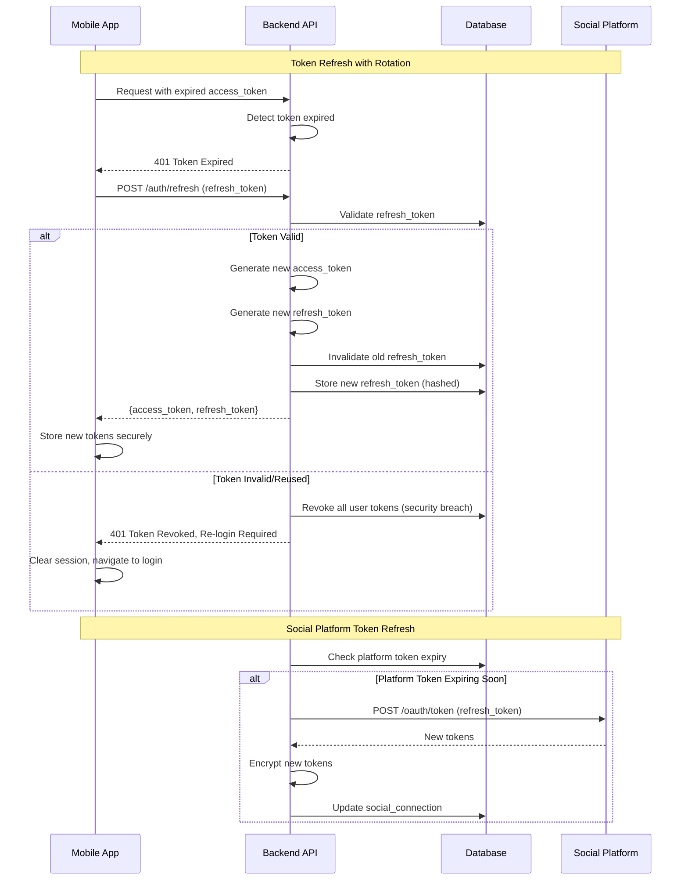
```mermaid
sequenceDiagram
    participant App as Mobile App
    participant API as Backend API
    participant DB as Database
    participant Platform as Social Platform

    Note over App,Platform: Token Refresh with Rotation
    
    App->>API: Request with expired access_token
    API->>API: Detect token expired
    API-->>App: 401 Token Expired
    
    App->>API: POST /auth/refresh (refresh_token)
    API->>DB: Validate refresh_token
    
    alt Token Valid
        API->>API: Generate new access_token
        API->>API: Generate new refresh_token
        API->>DB: Invalidate old refresh_token
        API->>DB: Store new refresh_token (hashed)
        API-->>App: {access_token, refresh_token}
        App->>App: Store new tokens securely
    else Token Invalid/Reused
        API->>DB: Revoke all user tokens (security breach)
        API-->>App: 401 Token Revoked, Re-login Required
        App->>App: Clear session, navigate to login
    end
    
    Note over App,Platform: Social Platform Token Refresh
    
    API->>DB: Check platform token expiry
    
    alt Platform Token Expiring Soon
        API->>Platform: POST /oauth/token (refresh_token)
        Platform-->>API: New tokens
        API->>API: Encrypt new tokens
        API->>DB: Update social_connection
    end
```

#### Token Rotation Implementation

```python
# core/token_rotation.py
class RefreshTokenManager:
    """Handles secure refresh token rotation"""
    
    TOKEN_FAMILY_EXPIRY = timedelta(days=30)
    REUSE_DETECTION_WINDOW = timedelta(seconds=30)
    
    async def rotate_refresh_token(
        self,
        db: Session,
        old_refresh_token: str
    ) -> Tuple[str, str]:
        """
        Rotate refresh token with reuse detection.
        
        Security features:
        1. Each refresh token can only be used once
        2. If a token is reused, entire token family is revoked
        3. Tokens are stored hashed, only once for verification
        """
        # Verify and find token
        token_record = db.query(RefreshToken).filter(
            RefreshToken.token_hash == hash_token(old_refresh_token),
            RefreshToken.revoked_at.is_(None)
        ).first()
        
        if not token_record:
            # Token not found or already used - potential breach
            await self._handle_reuse_detection(db, old_refresh_token)
            raise TokenReuseDetectedError()
        
        if token_record.expires_at < datetime.utcnow():
            raise TokenExpiredError()
        
        # Generate new token pair
        new_access_token = create_access_token(user_id=token_record.user_id)
        new_refresh_token = secrets.token_urlsafe(32)
        
        # Revoke old token
        token_record.revoked_at = datetime.utcnow()
        
        # Create new token record (same family)
        new_token_record = RefreshToken(
            user_id=token_record.user_id,
            token_hash=hash_token(new_refresh_token),
            family_id=token_record.family_id,
            expires_at=datetime.utcnow() + self.TOKEN_FAMILY_EXPIRY,
            created_at=datetime.utcnow()
        )
        db.add(new_token_record)
        db.commit()
        
        return new_access_token, new_refresh_token
    
    async def _handle_reuse_detection(self, db: Session, token: str):
        """Revoke entire token family when reuse detected"""
        # This could be an attack - revoke all tokens for this family
        # and optionally notify user of suspicious activity
        pass
```

#### Refresh Token Database Schema

```sql
CREATE TABLE refresh_tokens (
    id SERIAL PRIMARY KEY,
    user_id INTEGER REFERENCES users(id) ON DELETE CASCADE,
    token_hash VARCHAR(64) NOT NULL,  -- SHA-256 hash
    family_id UUID NOT NULL,          -- Groups related tokens
    device_info JSON,                  -- Device fingerprint
    created_at TIMESTAMP DEFAULT NOW(),
    expires_at TIMESTAMP NOT NULL,
    revoked_at TIMESTAMP,
    revoked_reason VARCHAR(50)        -- 'rotation', 'logout', 'security'
);

CREATE INDEX idx_refresh_tokens_hash ON refresh_tokens(token_hash);
CREATE INDEX idx_refresh_tokens_family ON refresh_tokens(family_id);
CREATE INDEX idx_refresh_tokens_user ON refresh_tokens(user_id);
```

---

### Platform Size Limits & Constraints

Each social media platform has specific constraints for posts. The system will enforce and adapt to these limits:

#### Platform Content Limits

| Platform | Text Limit | Image Size | Video Size | Video Duration | Images/Post |
|----------|------------|------------|------------|----------------|-------------|
| **Instagram** | 2,200 chars | 30MB | 650MB | 60s (Feed), 90s (Reels) | 10 |
| **Twitter/X** | 280 chars (Free), 10K (Premium) | 5MB | 512MB | 2:20 min | 4 |
| **LinkedIn** | 3,000 chars | 10MB | 200MB | 10 min | 9 |
| **Facebook** | 63,206 chars | 4MB | 10GB | 240 min | 10 |

#### Size Limit Configuration

```python
# config/platform_limits.py
from dataclasses import dataclass
from typing import List

@dataclass
class MediaLimit:
    max_size_mb: float
    allowed_formats: List[str]
    max_dimension: int
    aspect_ratios: List[str]

@dataclass
class PlatformLimits:
    text_max_length: int
    text_min_length: int = 0
    hashtag_max_count: int = 30
    image: MediaLimit = None
    video: MediaLimit = None
    images_per_post: int = 1
    video_max_duration_seconds: int = 0
    requires_media: bool = False
    supports_carousel: bool = False
    supports_stories: bool = False

PLATFORM_LIMITS = {
    'instagram': PlatformLimits(
        text_max_length=2200,
        hashtag_max_count=30,
        image=MediaLimit(
            max_size_mb=30,
            allowed_formats=['jpg', 'jpeg', 'png'],
            max_dimension=1440,
            aspect_ratios=['1:1', '4:5', '1.91:1']
        ),
        video=MediaLimit(
            max_size_mb=650,
            allowed_formats=['mp4', 'mov'],
            max_dimension=1920,
            aspect_ratios=['9:16', '4:5', '1:1']
        ),
        images_per_post=10,
        video_max_duration_seconds=60,
        requires_media=True,
        supports_carousel=True,
        supports_stories=True
    ),
    'twitter': PlatformLimits(
        text_max_length=280,
        hashtag_max_count=10,
        image=MediaLimit(
            max_size_mb=5,
            allowed_formats=['jpg', 'jpeg', 'png', 'gif', 'webp'],
            max_dimension=4096,
            aspect_ratios=['16:9', '1:1']
        ),
        video=MediaLimit(
            max_size_mb=512,
            allowed_formats=['mp4'],
            max_dimension=1920,
            aspect_ratios=['16:9', '1:1']
        ),
        images_per_post=4,
        video_max_duration_seconds=140,
        supports_carousel=False
    ),
    'linkedin': PlatformLimits(
        text_max_length=3000,
        hashtag_max_count=5,
        image=MediaLimit(
            max_size_mb=10,
            allowed_formats=['jpg', 'jpeg', 'png'],
            max_dimension=7680,
            aspect_ratios=['1.91:1', '1:1', '4:5']
        ),
        video=MediaLimit(
            max_size_mb=200,
            allowed_formats=['mp4', 'mov', 'avi'],
            max_dimension=4096,
            aspect_ratios=['16:9', '1:1', '9:16']
        ),
        images_per_post=9,
        video_max_duration_seconds=600,
        supports_carousel=True
    ),
    'facebook': PlatformLimits(
        text_max_length=63206,
        hashtag_max_count=30,
        image=MediaLimit(
            max_size_mb=4,
            allowed_formats=['jpg', 'jpeg', 'png', 'gif'],
            max_dimension=2048,
            aspect_ratios=['1.91:1', '1:1', '4:5', '9:16']
        ),
        video=MediaLimit(
            max_size_mb=10240,  # 10GB
            allowed_formats=['mp4', 'mov'],
            max_dimension=4096,
            aspect_ratios=['16:9', '9:16', '1:1']
        ),
        images_per_post=10,
        video_max_duration_seconds=14400,  # 240 minutes
        supports_carousel=True,
        supports_stories=True
    )
}
```

#### Content Validation Service

```python
# services/content_validator.py
class ContentValidator:
    """Validates content against platform constraints"""
    
    async def validate_for_platforms(
        self,
        content: str,
        media_files: List[MediaFile],
        target_platforms: List[str]
    ) -> ValidationResult:
        """
        Validate content for each platform.
        Returns per-platform validation results.
        """
        results = {}
        
        for platform in target_platforms:
            limits = PLATFORM_LIMITS.get(platform)
            if not limits:
                results[platform] = ValidationError(f'Unknown platform: {platform}')
                continue
            
            errors = []
            warnings = []
            
            # Text validation
            if len(content) > limits.text_max_length:
                errors.append(
                    f'Text exceeds {platform} limit: '
                    f'{len(content)}/{limits.text_max_length} chars'
                )
            
            # Hashtag count
            hashtag_count = content.count('#')
            if hashtag_count > limits.hashtag_max_count:
                warnings.append(
                    f'Too many hashtags for {platform}: '
                    f'{hashtag_count}/{limits.hashtag_max_count}'
                )
            
            # Media validation
            for media in media_files:
                media_errors = await self._validate_media(media, limits, platform)
                errors.extend(media_errors)
            
            # Media count
            if len(media_files) > limits.images_per_post:
                errors.append(
                    f'Too many media files for {platform}: '
                    f'{len(media_files)}/{limits.images_per_post}'
                )
            
            results[platform] = ValidationResult(
                valid=len(errors) == 0,
                errors=errors,
                warnings=warnings,
                suggestions=self._generate_suggestions(content, limits)
            )
        
        return results
    
    def _generate_suggestions(self, content: str, limits: PlatformLimits) -> List[str]:
        """Generate suggestions to optimize content for platform"""
        suggestions = []
        
        if len(content) > limits.text_max_length * 0.9:
            suggestions.append(
                f'Consider shortening text (currently {len(content)} chars, '
                f'limit is {limits.text_max_length})'
            )
        
        return suggestions
```

---

### Schema Changes for Platform Connections

When platforms are fully connected, the following schema enhancements will be implemented:

#### Enhanced Post Model

```python
# models/post.py - Future Schema
class Post(Base):
    __tablename__ = 'posts'
    
    id = Column(Integer, primary_key=True)
    user_id = Column(Integer, ForeignKey('users.id'), nullable=False)
    
    # Content
    content = Column(Text, nullable=True)
    media_urls = Column(JSON, default=list)  # List of GCS URLs
    
    # Publishing Status
    status = Column(String(20), default='draft')  # draft, scheduled, publishing, published, failed
    
    # Platform-Specific Publishing Results
    platform_posts = Column(JSON, default=dict)
    """
    Structure:
    {
        "instagram": {
            "status": "published",
            "platform_post_id": "17890...",
            "platform_permalink": "https://instagram.com/p/...",
            "published_at": "2025-12-24T10:00:00Z",
            "metrics": {"likes": 0, "comments": 0}  # Updated by analytics sync
        },
        "twitter": {
            "status": "published",
            "platform_post_id": "167890...",
            "platform_permalink": "https://twitter.com/user/status/...",
            "published_at": "2025-12-24T10:00:01Z"
        },
        "linkedin": {
            "status": "failed",
            "error": "Rate limit exceeded",
            "retry_at": "2025-12-24T11:00:00Z"
        }
    }
    """
    
    # Scheduling
    scheduled_at = Column(DateTime, nullable=True)
    published_at = Column(DateTime, nullable=True)
    
    # Platform Targeting
    target_platforms = Column(JSON, default=list)  # ['instagram', 'twitter']
    
    # Inspire Section (Internal)
    is_inspire_post = Column(Boolean, default=False)
    inspire_visibility = Column(String(20), default='public')  # public, followers, private
    
    # Engagement Metrics (for Inspire)
    likes_count = Column(Integer, default=0)
    comments_count = Column(Integer, default=0)
    shares_count = Column(Integer, default=0)
    
    # Content Metadata
    content_type = Column(String(20), default='post')  # post, story, reel, thread
    hashtags = Column(JSON, default=list)
    mentions = Column(JSON, default=list)
    location = Column(String(255), nullable=True)
    
    # AI Generation Metadata
    is_ai_generated = Column(Boolean, default=False)
    ai_prompt = Column(Text, nullable=True)
    ai_model = Column(String(50), nullable=True)
    
    # Timestamps
    created_at = Column(DateTime, default=func.now())
    updated_at = Column(DateTime, default=func.now(), onupdate=func.now())
    
    # Relationships
    user = relationship('User', back_populates='posts')
    comments = relationship('Comment', back_populates='post', cascade='all, delete-orphan')
    likes = relationship('Like', back_populates='post', cascade='all, delete-orphan')
```

#### Enhanced Social Connections Model

```python
# models/social_connection.py - Future Schema
class SocialConnection(Base):
    __tablename__ = 'social_connections'
    
    id = Column(Integer, primary_key=True)
    user_id = Column(Integer, ForeignKey('users.id'), nullable=False)
    platform = Column(String(50), nullable=False)  # instagram, twitter, linkedin, facebook
    
    # Platform Account Info
    platform_user_id = Column(String(255), nullable=False)
    platform_username = Column(String(255), nullable=True)
    platform_display_name = Column(String(255), nullable=True)
    platform_profile_picture = Column(Text, nullable=True)
    
    # OAuth Tokens (Encrypted at rest)
    access_token = Column(Text, nullable=False)  # AES-256 encrypted
    refresh_token = Column(Text, nullable=True)  # AES-256 encrypted
    token_expires_at = Column(DateTime, nullable=True)
    
    # Token Metadata
    scopes = Column(Text, nullable=True)  # Comma-separated scopes granted
    token_type = Column(String(50), default='Bearer')
    
    # Connection Status
    status = Column(String(20), default='active')  # active, expired, revoked, error
    last_error = Column(Text, nullable=True)
    error_count = Column(Integer, default=0)
    last_successful_action = Column(DateTime, nullable=True)
    
    # Platform-Specific Settings
    platform_settings = Column(JSON, default=dict)
    """
    Structure varies by platform:
    Instagram: {
        "account_type": "business",  # creator, business, personal
        "instagram_business_account_id": "17890...",
        "facebook_page_id": "12345...",  # For Instagram Business
        "posting_enabled": true,
        "stories_enabled": true,
        "reels_enabled": false
    }
    Twitter: {
        "tier": "free",  # free, basic, pro, enterprise
        "rate_limits": {"tweets_per_day": 50, "media_per_tweet": 4},
        "dm_enabled": true
    }
    LinkedIn: {
        "organization_id": null,  # For company pages
        "posting_as": "member",  # member, organization
        "article_enabled": true
    }
    """
    
    # Rate Limiting
    rate_limit_remaining = Column(Integer, nullable=True)
    rate_limit_reset_at = Column(DateTime, nullable=True)
    
    # Usage Analytics
    posts_published = Column(Integer, default=0)
    last_post_at = Column(DateTime, nullable=True)
    
    # Timestamps
    created_at = Column(DateTime, default=func.now())
    updated_at = Column(DateTime, default=func.now(), onupdate=func.now())
    
    # Unique constraint: one connection per platform per user
    __table_args__ = (
        UniqueConstraint('user_id', 'platform', name='uq_user_platform'),
    )
    
    user = relationship('User', back_populates='social_connections')
```

#### Migration Script for Schema Changes

```python
# alembic/versions/xxxx_add_platform_fields.py
"""Add platform-specific fields to posts and social_connections

Revision ID: xxxx
"""
from alembic import op
import sqlalchemy as sa
from sqlalchemy.dialects import postgresql

def upgrade():
    # Posts table enhancements
    op.add_column('posts', sa.Column('platform_posts', postgresql.JSON(), default={}))
    op.add_column('posts', sa.Column('status', sa.String(20), default='draft'))
    op.add_column('posts', sa.Column('scheduled_at', sa.DateTime(), nullable=True))
    op.add_column('posts', sa.Column('target_platforms', postgresql.JSON(), default=[]))
    op.add_column('posts', sa.Column('content_type', sa.String(20), default='post'))
    op.add_column('posts', sa.Column('is_ai_generated', sa.Boolean(), default=False))
    op.add_column('posts', sa.Column('hashtags', postgresql.JSON(), default=[]))
    op.add_column('posts', sa.Column('shares_count', sa.Integer(), default=0))
    
    # Social connections enhancements
    op.add_column('social_connections', sa.Column('status', sa.String(20), default='active'))
    op.add_column('social_connections', sa.Column('last_error', sa.Text(), nullable=True))
    op.add_column('social_connections', sa.Column('error_count', sa.Integer(), default=0))
    op.add_column('social_connections', sa.Column('platform_settings', postgresql.JSON(), default={}))
    op.add_column('social_connections', sa.Column('rate_limit_remaining', sa.Integer(), nullable=True))
    op.add_column('social_connections', sa.Column('rate_limit_reset_at', sa.DateTime(), nullable=True))
    op.add_column('social_connections', sa.Column('posts_published', sa.Integer(), default=0))
    op.add_column('social_connections', sa.Column('last_post_at', sa.DateTime(), nullable=True))
    op.add_column('social_connections', sa.Column('last_successful_action', sa.DateTime(), nullable=True))

def downgrade():
    # Remove added columns
    op.drop_column('posts', 'platform_posts')
    op.drop_column('posts', 'status')
    # ... etc
```

---

## Resilience & Error Handling

### Internet Connectivity Loss During Upload

When uploading media or publishing content, internet connectivity issues must be handled gracefully:

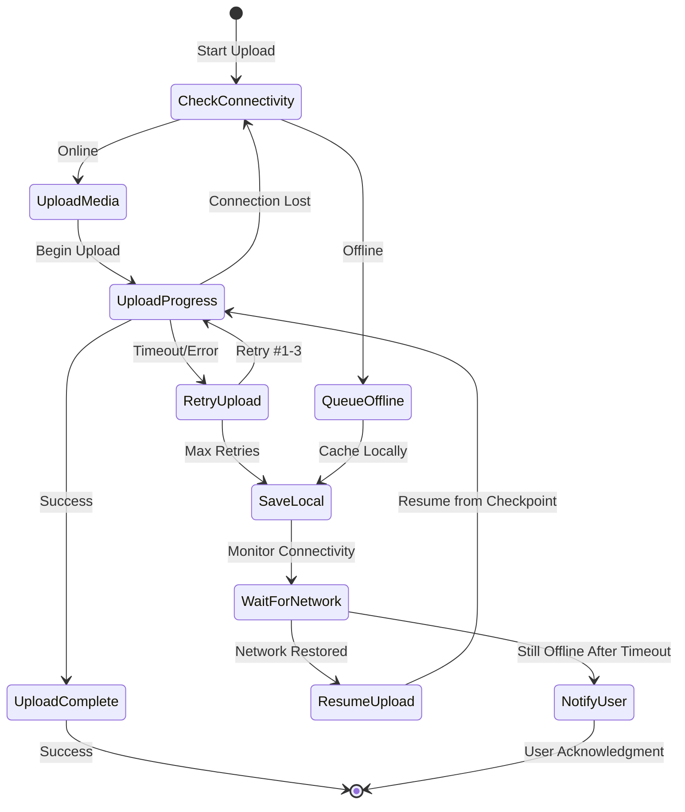
```mermaid
stateDiagram-v2
    [*] --> CheckConnectivity: Start Upload
    
    CheckConnectivity --> UploadMedia: Online
    CheckConnectivity --> QueueOffline: Offline
    
    UploadMedia --> UploadProgress: Begin Upload
    UploadProgress --> CheckConnectivity: Connection Lost
    UploadProgress --> UploadComplete: Success
    UploadProgress --> RetryUpload: Timeout/Error
    
    RetryUpload --> UploadProgress: Retry #1-3
    RetryUpload --> SaveLocal: Max Retries
    
    QueueOffline --> SaveLocal: Cache Locally
    SaveLocal --> WaitForNetwork: Monitor Connectivity
    WaitForNetwork --> ResumeUpload: Network Restored
    WaitForNetwork --> NotifyUser: Still Offline After Timeout
    
    ResumeUpload --> UploadProgress: Resume from Checkpoint
    UploadComplete --> [*]: Success
    NotifyUser --> [*]: User Acknowledgment
```

#### Offline-First Upload Strategy

```dart
// services/resilient_upload_service.dart
class ResilientUploadService {
  final _connectivity = Connectivity();
  final _localStorage = LocalUploadQueue();
  final _uploadApi = UploadService();
  
  /// Upload media with automatic retry and offline queueing
  Future<UploadResult> uploadWithResilience({
    required String filePath,
    required String postDraftId,
    int maxRetries = 3,
    Duration timeout = const Duration(minutes: 5),
  }) async {
    // Check current connectivity
    final connectivityResult = await _connectivity.checkConnectivity();
    if (connectivityResult == ConnectivityResult.none) {
      return _queueForLater(filePath, postDraftId);
    }
    
    int attempt = 0;
    UploadProgress? lastProgress;
    
    while (attempt < maxRetries) {
      try {
        // Start or resume upload
        final result = await _uploadApi.uploadFile(
          filePath: filePath,
          resumeFrom: lastProgress?.bytesUploaded,
          onProgress: (progress) {
            lastProgress = progress;
            _notifyProgress(postDraftId, progress);
          },
        ).timeout(timeout);
        
        // Success!
        return UploadResult.success(url: result.url);
        
      } on SocketException catch (e) {
        // Network issue - queue for later
        return _queueForLater(filePath, postDraftId, resumeFrom: lastProgress);
        
      } on TimeoutException catch (e) {
        attempt++;
        if (attempt >= maxRetries) {
          return _queueForLater(filePath, postDraftId, resumeFrom: lastProgress);
        }
        // Wait before retry with exponential backoff
        await Future.delayed(Duration(seconds: pow(2, attempt).toInt()));
        
      } on UploadException catch (e) {
        if (e.isRetryable) {
          attempt++;
          continue;
        }
        return UploadResult.failed(error: e.message);
      }
    }
    
    return UploadResult.failed(error: 'Max retries exceeded');
  }
  
  /// Queue upload for when network is available
  UploadResult _queueForLater(
    String filePath,
    String postDraftId, {
    UploadProgress? resumeFrom,
  }) {
    _localStorage.addToQueue(UploadQueueItem(
      filePath: filePath,
      postDraftId: postDraftId,
      resumeFromByte: resumeFrom?.bytesUploaded ?? 0,
      queuedAt: DateTime.now(),
    ));
    
    // Start monitoring for network restoration
    _startNetworkMonitor();
    
    return UploadResult.queued(
      message: 'Upload queued. Will resume when online.',
    );
  }
  
  /// Monitor connectivity and resume queued uploads
  void _startNetworkMonitor() {
    _connectivity.onConnectivityChanged.listen((result) async {
      if (result != ConnectivityResult.none) {
        await _processQueue();
      }
    });
  }
  
  /// Process all queued uploads
  Future<void> _processQueue() async {
    final queue = await _localStorage.getQueue();
    
    for (final item in queue) {
      final result = await uploadWithResilience(
        filePath: item.filePath,
        postDraftId: item.postDraftId,
      );
      
      if (result.isSuccess) {
        await _localStorage.removeFromQueue(item.id);
        // Notify user of successful background upload
        _showNotification('Upload completed for your draft');
      }
    }
  }
}
```

#### Local Upload Queue Schema (SQLite)

```dart
// models/upload_queue.dart
class UploadQueueItem {
  final String id;
  final String filePath;
  final String postDraftId;
  final int resumeFromByte;
  final DateTime queuedAt;
  final int retryCount;
  final String? lastError;
  final UploadQueueStatus status;  // pending, uploading, completed, failed
}

// Database table (drift/sqflite)
// CREATE TABLE upload_queue (
//   id TEXT PRIMARY KEY,
//   file_path TEXT NOT NULL,
//   post_draft_id TEXT NOT NULL,
//   resume_from_byte INTEGER DEFAULT 0,
//   queued_at INTEGER NOT NULL,
//   retry_count INTEGER DEFAULT 0,
//   last_error TEXT,
//   status TEXT DEFAULT 'pending'
// );
```

#### Platform Publishing Failure Recovery

```dart
// providers/publish_provider.dart
class PublishProvider extends ChangeNotifier {
  final _publishService = PublishService();
  final _offlineQueue = OfflinePublishQueue();
  
  Map<String, PublishStatus> _platformStatuses = {};
  
  /// Publish to multiple platforms with individual failure handling
  Future<MultiPlatformResult> publishToAll({
    required Post post,
    required List<String> platforms,
  }) async {
    _platformStatuses = {
      for (var p in platforms) p: PublishStatus.inProgress()
    };
    notifyListeners();
    
    final results = <String, PublishResult>{};
    
    // Publish to each platform concurrently
    await Future.wait(platforms.map((platform) async {
      try {
        final result = await _publishService.publishToPlatform(
          post: post,
          platform: platform,
        );
        
        results[platform] = result;
        _platformStatuses[platform] = PublishStatus.success(
          platformPostId: result.platformPostId,
          permalink: result.permalink,
        );
        
      } on NetworkException {
        results[platform] = PublishResult.queued();
        _platformStatuses[platform] = PublishStatus.queued(
          message: 'Will publish when online',
        );
        await _offlineQueue.add(post, platform);
        
      } on PlatformException catch (e) {
        results[platform] = PublishResult.failed(error: e.message);
        _platformStatuses[platform] = PublishStatus.failed(
          error: e.message,
          isRetryable: e.isRetryable,
        );
      }
      
      notifyListeners();
    }));
    
    return MultiPlatformResult(
      overallSuccess: results.values.any((r) => r.isSuccess),
      platformResults: results,
    );
  }
  
  /// Retry failed platform publishing
  Future<void> retryPlatform(String postId, String platform) async {
    // Implementation
  }
}
```

---

### CMS AI Disconnection & Error Handling

When the AI service (LLM/Image generation) becomes unavailable or returns errors:

```mermaid
flowchart TB
    subgraph "Error Detection"
        REQ[AI Request] --> CHECK{Service Available?}
        CHECK -->|Yes| PROCESS[Process Request]
        CHECK -->|No| FALLBACK[Fallback Mode]
    end
    
    subgraph "Error Types"
        PROCESS --> TIMEOUT{Request Timeout?}
        PROCESS --> RATELIMIT{Rate Limited?}
        PROCESS --> ERROR{API Error?}
        PROCESS --> SUCCESS[Success]
    end
    
    subgraph "Recovery Actions"
        TIMEOUT -->|Yes| RETRY[Retry with Backoff]
        RATELIMIT -->|Yes| QUEUE[Queue & Wait]
        ERROR -->|Transient| RETRY
        ERROR -->|Permanent| FALLBACK
        
        RETRY -->|Max Retries| FALLBACK
        QUEUE --> RETRY
    end
    
    subgraph "Fallback Strategies"
        FALLBACK --> CACHE[Cached Response]
        FALLBACK --> ALT[Alternative Provider]
        FALLBACK --> MANUAL[Manual Mode Prompt]
        FALLBACK --> NOTIFY[Notify User]
    end
    
    SUCCESS --> USER[Return to User]
    CACHE --> USER
    ALT --> USER
    MANUAL --> USER
```

#### AI Service Error Handling

```python
# services/ai_service.py
from enum import Enum
from typing import Optional
import asyncio

class AIErrorType(Enum):
    TIMEOUT = "timeout"
    RATE_LIMITED = "rate_limited"
    SERVICE_UNAVAILABLE = "service_unavailable"
    CONTENT_FILTERED = "content_filtered"
    QUOTA_EXCEEDED = "quota_exceeded"
    INVALID_REQUEST = "invalid_request"
    UNKNOWN = "unknown"

class AIServiceError(Exception):
    def __init__(
        self,
        error_type: AIErrorType,
        message: str,
        retry_after: Optional[int] = None,
        is_retryable: bool = True
    ):
        self.error_type = error_type
        self.message = message
        self.retry_after = retry_after
        self.is_retryable = is_retryable
        super().__init__(message)

class ResilientAIService:
    """AI service with comprehensive error handling and fallbacks"""
    
    def __init__(self):
        self.primary_provider = OpenAIProvider()
        self.fallback_provider = GeminiProvider()
        self.local_cache = AIResponseCache()
        self.circuit_breaker = CircuitBreaker(
            failure_threshold=5,
            recovery_timeout=60
        )
    
    async def generate_content(
        self,
        prompt: str,
        options: GenerationOptions,
        max_retries: int = 3
    ) -> AIGenerationResult:
        """
        Generate content with automatic retry, fallback, and circuit breaking.
        """
        # Check circuit breaker
        if self.circuit_breaker.is_open:
            return await self._use_fallback(prompt, options)
        
        attempt = 0
        last_error = None
        
        while attempt < max_retries:
            try:
                # Try primary provider
                result = await asyncio.wait_for(
                    self.primary_provider.generate(prompt, options),
                    timeout=30.0
                )
                
                self.circuit_breaker.record_success()
                
                # Cache successful response
                await self.local_cache.store(prompt, options, result)
                
                return result
                
            except asyncio.TimeoutError:
                last_error = AIServiceError(
                    AIErrorType.TIMEOUT,
                    "AI service request timed out",
                    is_retryable=True
                )
                attempt += 1
                self.circuit_breaker.record_failure()
                
            except RateLimitError as e:
                last_error = AIServiceError(
                    AIErrorType.RATE_LIMITED,
                    f"Rate limited: {e.message}",
                    retry_after=e.retry_after,
                    is_retryable=True
                )
                
                if e.retry_after and e.retry_after < 60:
                    await asyncio.sleep(e.retry_after)
                    attempt += 1
                else:
                    break  # Use fallback for long rate limits
                
            except ContentFilterError as e:
                # Don't retry - content itself is the issue
                return AIGenerationResult.filtered(
                    message="Content was filtered. Please modify your prompt.",
                    suggestion=e.suggestion
                )
                
            except QuotaExceededError:
                # User/global quota exceeded - can't retry
                return AIGenerationResult.quota_exceeded(
                    message="AI generation quota exceeded. Please try again later."
                )
                
            except ServiceUnavailableError:
                self.circuit_breaker.record_failure()
                break  # Immediately try fallback
                
            except Exception as e:
                last_error = AIServiceError(
                    AIErrorType.UNKNOWN,
                    str(e),
                    is_retryable=False
                )
                break
            
            # Exponential backoff between retries
            await asyncio.sleep(2 ** attempt)
        
        # All retries failed or non-retryable error
        return await self._use_fallback(prompt, options, last_error)
    
    async def _use_fallback(
        self,
        prompt: str,
        options: GenerationOptions,
        error: Optional[AIServiceError] = None
    ) -> AIGenerationResult:
        """Use fallback strategies when primary provider fails"""
        
        # Strategy 1: Try cached response
        cached = await self.local_cache.get_similar(prompt, options)
        if cached:
            return AIGenerationResult.from_cache(
                cached,
                message="Generated from cached template (AI temporarily unavailable)"
            )
        
        # Strategy 2: Try alternative provider
        try:
            result = await self.fallback_provider.generate(prompt, options)
            return AIGenerationResult.from_fallback(
                result,
                provider="gemini"
            )
        except Exception:
            pass
        
        # Strategy 3: Return template-based response
        template = self._get_template_response(options.content_type)
        if template:
            return AIGenerationResult.template(
                template,
                message="AI is temporarily unavailable. Here's a template to get started."
            )
        
        # Strategy 4: Suggest manual creation
        return AIGenerationResult.unavailable(
            message="AI content generation is temporarily unavailable.",
            suggestion="Please try again later or create content manually.",
            error_details=str(error) if error else None
        )
    
    def _get_template_response(self, content_type: str) -> Optional[str]:
        """Get pre-built template for content type"""
        templates = {
            "promotional": "🔥 Exciting news! [Your announcement here]\n\n✨ Key features:\n• Feature 1\n• Feature 2\n• Feature 3\n\n👉 [Call to action]\n\n#YourBrand #Launch",
            "educational": "📚 Did you know?\n\n[Your insight here]\n\n💡 Key takeaway:\n[Main point]\n\n🤔 What do you think? Comment below!\n\n#Learning #Tips",
            "engagement": "🎉 Time for some fun!\n\n[Your question or prompt]\n\nDrop your answer in the comments! 👇\n\n#Community #Engagement"
        }
        return templates.get(content_type)
```

#### Frontend AI Error UI

```dart
// widgets/ai_error_handler.dart
class AIErrorDisplay extends StatelessWidget {
  final AIError error;
  final VoidCallback? onRetry;
  final VoidCallback? onManualMode;
  
  Widget build(BuildContext context) {
    return Column(
      mainAxisSize: MainAxisSize.min,
      children: [
        Icon(
          _getErrorIcon(),
          size: 48,
          color: _getErrorColor(),
        ),
        SizedBox(height: 16),
        Text(
          _getErrorTitle(),
          style: TextStyle(
            fontSize: 18,
            fontWeight: FontWeight.bold,
          ),
        ),
        SizedBox(height: 8),
        Text(
          error.message,
          textAlign: TextAlign.center,
          style: TextStyle(color: Colors.grey),
        ),
        SizedBox(height: 24),
        _buildActionButtons(),
      ],
    );
  }
  
  Widget _buildActionButtons() {
    switch (error.type) {
      case AIErrorType.timeout:
      case AIErrorType.serviceUnavailable:
        return Row(
          mainAxisAlignment: MainAxisAlignment.center,
          children: [
            ElevatedButton.icon(
              onPressed: onRetry,
              icon: Icon(Icons.refresh),
              label: Text('Try Again'),
            ),
            SizedBox(width: 16),
            OutlinedButton.icon(
              onPressed: onManualMode,
              icon: Icon(Icons.edit),
              label: Text('Create Manually'),
            ),
          ],
        );
        
      case AIErrorType.rateLimited:
        return Column(
          children: [
            Text(
              'Please wait ${error.retryAfter} seconds',
              style: TextStyle(color: Colors.orange),
            ),
            SizedBox(height: 16),
            OutlinedButton.icon(
              onPressed: onManualMode,
              icon: Icon(Icons.edit),
              label: Text('Create Manually Instead'),
            ),
          ],
        );
        
      case AIErrorType.quotaExceeded:
        return OutlinedButton.icon(
          onPressed: onManualMode,
          icon: Icon(Icons.edit),
          label: Text('Create Manually'),
        );
        
      default:
        return OutlinedButton.icon(
          onPressed: onManualMode,
          icon: Icon(Icons.edit),
          label: Text('Create Manually'),
        );
    }
  }
}
```

#### Circuit Breaker Pattern

```python
# core/circuit_breaker.py
import time
from enum import Enum
from threading import Lock

class CircuitState(Enum):
    CLOSED = "closed"      # Normal operation
    OPEN = "open"          # Failing, reject requests
    HALF_OPEN = "half_open"  # Testing recovery

class CircuitBreaker:
    """
    Circuit breaker pattern to prevent cascading failures.
    
    - CLOSED: Requests flow normally, failures are counted
    - OPEN: Requests immediately fail without calling service
    - HALF_OPEN: Limited requests allowed to test recovery
    """
    
    def __init__(
        self,
        failure_threshold: int = 5,
        recovery_timeout: int = 60,
        half_open_requests: int = 3
    ):
        self.failure_threshold = failure_threshold
        self.recovery_timeout = recovery_timeout
        self.half_open_requests = half_open_requests
        
        self._state = CircuitState.CLOSED
        self._failure_count = 0
        self._success_count = 0
        self._last_failure_time = None
        self._half_open_successes = 0
        self._lock = Lock()
    
    @property
    def is_open(self) -> bool:
        with self._lock:
            if self._state == CircuitState.OPEN:
                if self._should_attempt_recovery():
                    self._state = CircuitState.HALF_OPEN
                    self._half_open_successes = 0
                    return False
                return True
            return False
    
    def record_success(self):
        with self._lock:
            if self._state == CircuitState.HALF_OPEN:
                self._half_open_successes += 1
                if self._half_open_successes >= self.half_open_requests:
                    self._state = CircuitState.CLOSED
                    self._failure_count = 0
            else:
                self._success_count += 1
    
    def record_failure(self):
        with self._lock:
            self._failure_count += 1
            self._last_failure_time = time.time()
            
            if self._failure_count >= self.failure_threshold:
                self._state = CircuitState.OPEN
    
    def _should_attempt_recovery(self) -> bool:
        if self._last_failure_time is None:
            return True
        elapsed = time.time() - self._last_failure_time
        return elapsed >= self.recovery_timeout
```

---

# 13. Conclusion

Vextra represents a comprehensive solution for modern content creators and social media managers. Built on industry-standard technologies and following best practices in software architecture, the platform provides:

1. **Unified Experience**: Single interface for managing multiple social platforms
2. **Efficient Workflows**: Streamlined content creation and publishing
3. **Real-time Collaboration**: Instant messaging and presence features
4. **Enterprise Security**: OAuth 2.0, encrypted tokens, secure authentication
5. **Scalable Architecture**: Cloud-native deployment with auto-scaling

The modular design ensures easy maintenance and extensibility, while the layered architecture provides clear separation of concerns. As social media continues to evolve, Vextra's flexible foundation allows for rapid adaptation to new platforms and features.

---

## Appendices

### A. Glossary

| Term | Definition |
|------|------------|
| OAuth | Open Authorization protocol for secure API access |
| JWT | JSON Web Token for stateless authentication |
| WebSocket | Full-duplex communication protocol |
| FCM | Firebase Cloud Messaging for push notifications |
| CRUD | Create, Read, Update, Delete operations |
| ORM | Object-Relational Mapping |
| CORS | Cross-Origin Resource Sharing |

### B. References

1. FastAPI Documentation: https://fastapi.tiangolo.com/
2. Flutter Documentation: https://docs.flutter.dev/
3. Meta Graph API: https://developers.facebook.com/docs/graph-api
4. Twitter API v2: https://developer.twitter.com/en/docs/twitter-api
5. LinkedIn API: https://developer.linkedin.com/
6. OAuth 2.0 Specification: RFC 6749
7. WebSocket Protocol: RFC 6455

---

**Document Version**: 1.0  
**Last Updated**: December 2025  
**Author**: Vextra Labs
**Project**: Vextra Labs

---

